

**Finnish Meteorological Institute / SmartMet Server / 2022-01-18**

# GRID SUPPORT

# TABLE OF CONTENTS

<ul>
  <li><a href="#chapter-1">1 GRID support</a>
  <ul>
    <li><a href="#chapter-1-1">1.1 Introduction</a>
  </ul>
  <li><a href="#chapter-2">2 Grid files</a>
  <ul>
    <li><a href="#chapter-2-1">2.1 Introduction</a>
    <li><a href="#chapter-2-2">2.2 Information</a>
    <li><a href="#chapter-2-3">2.3 File formats</a>
    <li><a href="#chapter-2-4">2.4 Usage</a>
    <li><a href="#chapter-2-5">2.5 Getting started</a>
  </ul>
  <li><a href="#chapter-3">3 Content Information</a>
  <ul>
    <li><a href="#chapter-3-1">3.1 Introduction</a>
    <ul>
      <li><a href="#chapter-3-1-1">3.1.1 Producer information</a>
      <li><a href="#chapter-3-1-2">3.1.2 Generation information</a>
      <li><a href="#chapter-3-1-3">3.1.3 Grid file information</a>
      <li><a href="#chapter-3-1-4">3.1.4 Grid Content information</a>
      <li><a href="#chapter-3-1-5">3.1.5 Event information</a>
    </ul>
    <li><a href="#chapter-3-2">3.2 Content Storage</a>
    <ul>
      <li><a href="#chapter-3-2-1">3.2.1 Redis implementation</a>
      <li><a href="#chapter-3-2-2">3.2.2 Memory-based implementation</a>
    </ul>
    <li><a href="#chapter-3-3">3.3 Accessing techniques</a>
    <ul>
      <li><a href="#chapter-3-3-1">3.3.1 Command-line client programs</a>
      <li><a href="#chapter-3-3-2">3.3.2 HTTP interface</a>
      <li><a href="#chapter-3-3-3">3.3.3 CORBA interface</a>
    </ul>
    <li><a href="#chapter-3-4">3.4 Feeding systems</a>
    <ul>
       <li><a href="#chapter-3-4-1">3.4.1 Other feeding systems</a>
    </ul>
    <li><a href="#chapter-3-5">3.5 Content Server APIs</a>
    <ul>
      <li><a href="#chapter-3-5-1">3.5.1 Introduction</a>
      <li><a href="#chapter-3-5-2">3.5.2 Service methods</a>
    </ul>
    <li><a href="#chapter-3-6">3.6 Getting started</a>
  </ul>
  <li><a href="#chapter-4">4 Data Server</a>
  <ul>
    <li><a href="#chapter-4-1">4.1 Introduction</a>
    <li><a href="#chapter-4-2">4.2 Usage</a>
    <li><a href="#chapter-4-3">4.3 Virtual Grid Files</a>
    <li><a href="#chapter-4-5">4.4 Data Server API</a>
    <ul>
      <li><a href="#chapter-4-4-1">4.4.1 Introduction</a>
      <li><a href="#chapter-4-4-2">4.4.2 Interpolation</a>
      <li><a href="#chapter-4-4-3">4.4.3 Service methods</a>
    </ul>
    <li><a href="#chapter-4-5">4.5 Getting started</a>
  </ul>
  <li><a href="#chapter-5">5 Query Server</a>
  <ul>
    <li><a href="#chapter-5-1">5.1 Introduction</a>
    <li><a href="#chapter-5-2">5.2 Query parameters</a>
    <li><a href="#chapter-5-3">5.3 Configuration</a>
  </ul>
  <li><a href="#chapter-6">6 SmartMet Server</a>
  <ul>
    <li><a href="#chapter-6-1">6.1 Introduction</a>
    <li><a href="#chapter-6-2">6.2 Architecture</a>
    <li><a href="#chapter-6-3">6.3 Grid Engine</a>
    <ul>
      <li><a href="#chapter-6-3-1">6.3.1 Introduction</a>
      <li><a href="#chapter-6-3-2">6.3.2 Documentation</a>
    </ul>
    <li><a href="#chapter-6-4">6.4 Grid-GUI Plugin</a>
    <ul>
      <li><a href="#chapter-6-4-1">6.4.1 Introduction</a>
      <li><a href="#chapter-6-4-2">6.4.2 Visualization</a>
      <li><a href="#chapter-6-4-3">6.4.3 Configuration</a>
    </ul>
    <li><a href="#chapter-6-5">6.5 Grid-Admin Plugin</a>
    <ul>
      <li><a href="#chapter-6-5-1">6.5.1 Introduction</a>
      <li><a href="#chapter-6-5-2">6.5.2 Configuration</a>
    </ul>
  </ul>
</ul>

# 1 GRID support

## 1.1 Introduction

The purpose of this document is to describe the general functionality of the SmartMet grid support. The current project has been quite long, because there have been hundreds of details and a lot of bigger and smaller problems that have to been solved.

In spite of that the implementation of this project differs a lot from the existing SmartMet component implementations, it is still quite compatible with the existing SmartMet architecture.

The most challenging task has been to keep all things configurable. In other words, we have not hard-coded things, which means that we can change the system behavior just by changing its configuration files. A drawback of this approach is that now we have a lot of different configuration files. This document tries to explain the content of these configuration files and also tell why they are needed.

# 2 Grid files

## 2.1 Introduction

Probably the easiest way to understand a grid is to think it as a two-dimensional matrix of points. Each point has a **1) geographical location** and **2) a value**. These values can represent for example weather forecast values (temperature, pressure, etc.) in the current geographical locations. A grid is not necessary always a rectangle, but at the moment we support only rectangular grids.

Geographical distances between the points might be equal when distances are expressed in meters or kilometers (for example 15km). In this case the grid does not look rectangular in the world map (where longitudes are X-coordinates and latitudes are Y-coordinates), because the world is a sphere. This is shown in the figure below.

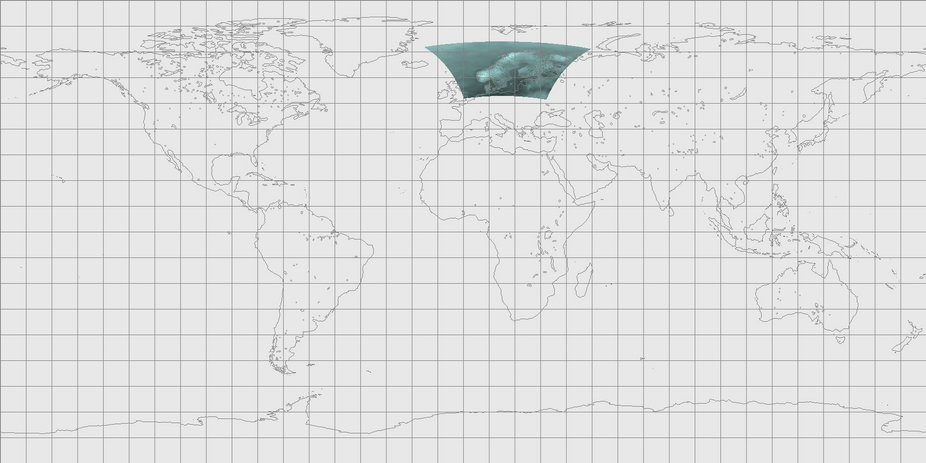

However, when distances are expressed for example in latitude/longitude degrees, geographical distances of the grid point vary. If grid point distances are expressed in latitude/longitude degrees then the grid looks rectangular in the world map where longitudes are X-coordinates and latitudes are Y-coordinates. This is shown in the figure below.

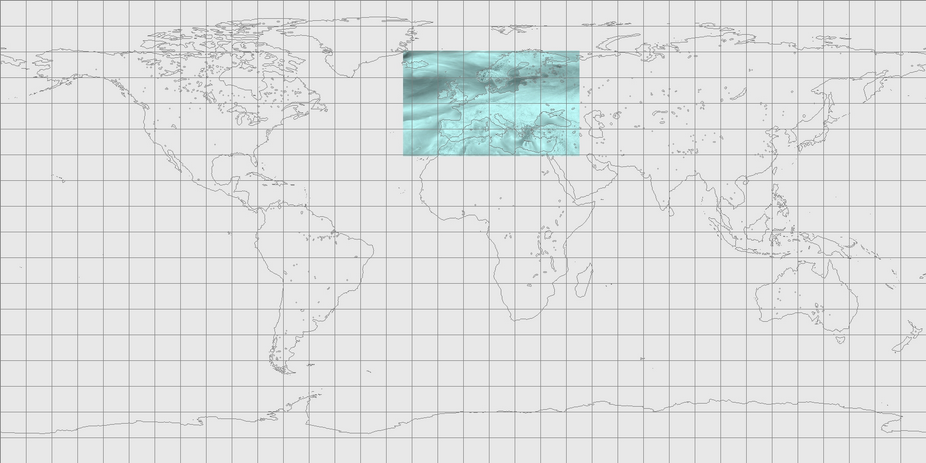

## 2.2 Information

In order to store grid information, we need to store at least the following things:

**1. Grid dimensions**

If the grid is rectangular then we need to know how many rows and columns it has.

**2. Geographical locations of grid points (=> coordinates)**

Grid location information is usually stored by using projections / geometry definitions. For example, we can define the location of one grid corner by using latitudes and longitudes. After that we can define the location of the other grid points by using x- and y-distance definitions (for example, x-distance is 15km and y-distance is 12.5 km, or x-distance is 0.20 degrees and y-distance is 0.18 degrees).

**3. Grid point values**

These values might represent for example temperature values in the current geographical area. We should store a value for each grid point. If the grid has N rows and M columns then we should store N*M values.

In addition, we might want to store the following things as well:

**4. Grid data identification**

If we have multiple grids containing different kind of information (temperatures, pressures, wind speed, etc.), we probably want to store some identification information that helps us to recognize the content of these grids.

**5. Level information**

In some cases, we need to define also the vertical dimension of the geographical location. In this case we usually define the type of the level (ground level, sea level, pressure level, etc.) where the actual level value is measured, and the value of the actual level (for example, 2m, 10m, 1km, 100000Pa, 50000Pa, etc.).

**6. Time information**

Usually, grid data has direct relationship to time. For example, if a grid is used for weather forecast, it must contain a time-stamp that indicates when the current forecast is valid. It does not make sense to generate values for a weather forecast if we do not know when the forecast is valid.

**7. Type information**

There are different types of grids. For example, a grid can contain observation information, forecast information, climatological information, etc.

**8. Information number / index**

Some grid types might contain a group of grids. For example, an ensemble forecasts usually contains several grids that are uniquely identified by their ensemble number.

## 2.3 File formats

Grids can be stored by using many kinds of file formats. Currently our system supports GRIB-1, GRIB-2, NetCDF and QueryData file formats. Unfortunately, these formats are quite popular, but from a programmer's point of view some of them are just terrible.

There are several reasons why some of these file formats are quite bad:

**1. Information extraction**

It's not possible to extract information from GRIB files without processing the actual information content. For example, if the field X has value 1 then the structure of the rest of the file is totally different compared to case where the field X has value 2, which is totally different compared to case where the field X has value 3. Unfortunately, GRIB files contain several similar fields with tens of different value options, which all effect how the information can be extracted from these files.

That's why extracting information from GRIB files requires several thousands of code lines. With a better designed format, we should be able to extract all necessary sections and information attributes with few hundred code lines. The actual processing of this information can require a lot of code, but the information extraction should be as simple as possible. Luckily, NetCDF and QueryData files are quite easy to extract.

**2. Information addition**

When new projections or products are added into GRIB file definitions, this means usually that also the software code that is using GRIB files must be updated. That's because the information cannot be extracted from GRIB files without actual processing of the information of the current file.

**3. Information definition**

GRIB files contain a lot of fields which values are defined in external tables. These tables define meaning for values used in certain fields. For example, table 4.5 defines values for grid level types. Unfortunately, each GRIB file defines which version of these tables it is using. At the moment, there are at least 19 versions of these tables.

We assume in our implementation that already defined values do not change in different versions (i.e new definitions can be added but existing definitions are not overridden). For example, in the table 4.5 there is definition that value 101 means "Mean Sea Level". We assume that this value does not change event that table versions are changing. If this is not the case then this could be the most brainless file format ever.

**4. Information identification**

Identification of the actual grid data is just a nightmare. GRIB-1 and GRIB-2 use totally different fields and values to identify the grid data. This means in practice that we cannot say that the both files contain the same data without using external mapping files. So, we need mappings that say for example that temperature values are identified with number A, B and C in GRIB-1 files and with number D, E and F in GRIB-2 files.

On the other hand, different producers might use different values in order to identify same parameters. For example, the producer A might use value 123 to identify temperature data meanwhile the producer B identifies the same temperature data with value 56.

I addition, the identification requires usually 2 - 8 different fields, which causes "overlapping" identifications. For example, "temperature" is identified in GRIB-2 by using fields "discipline", "parameterCategory" and "parameterNumber", meanwhile "temperature-2m" uses the same fields plus expects that "levelType" field is 103 and the "level" field is 2. What if we try to identify a grid which level type is "undefined", but the level value is 2. Should it be identified to be "temperature-2m" or "temperature"?  This is just a total chaos.

In spite of that the level type and the level value are important information, data identifiers should never depend on this kind of information. The point is that we should be able to said that the current data is "temperature", "pressure", "wind speed", etc. data, and the level type and the level value just define its location from vertical point of view (just like coordinates defines its geographical location).

Unfortunately, GRIB files are so widely used that it is difficult to get rid of them very soon.

## 2.4 Usage

From a programmer's point of view, the biggest challenge with grid files is to extract information from these files. However, from a user's point of view, the biggest challenge is to map this information in some usable form. For example, how GRIB-1 and GRIB-2 temperature identifiers can be mapped so that from a user's point of view there is just one temperature identifier that the user can use for searching temperature values from different levels. The point is that each level should not have its own temperature identifier.

The Grid-Files Library was developed during the grid support project. It is used for opening and reading grid files. In practice, all component of the grid support implementation uses this library in order to process grid files. When a grid file is opened with this library, it tries automatically identify content of the current file. This means in practice that it tries to map information used in the current file format into information used in the SmartMet server environment.  

Technically, all file format specific identifiers are mapped into so called FMI-identifiers. This means for example, that all grid parameter identifiers (like grib-id, NetCDF-name, Newbase-name, etc.) are mapped to FMI parameter identifiers, all level type identifiers are mapped to FMI level identifiers, and so on. The point is that in this way we can say which parameters and levels are equal in spite of that they might be defined in different grid files.

The configuration and the usage of this library is described in the “grid-files.pdf” document.

Notice that there are several SmartMet components (like the Grid Engine and the Grid-GUI Plugin) that are using the Grid-Files Library, which means that they need to initialize the current library before they can use it. That's why the configuration files of these components usually define also the location of the configuration file used by the Grid-Files library.

It is also possible that other components create their own configuration files with different mappings and initialize the Grid-Files Library with their own setting. The point is that there are no limitations or standards how to map grid data identifier to another identifiers, or even what kind of parameters we have in the first place. So, everybody can define their own identifiers and create mappings for these identifiers if they want.

In spite of that this all is possible, it requires a lot configuration, because all organizations seem to have their own way to define things. So, there are no standard way to do this.

## 2.5 Getting started

The easiest way to test the Grid-Files Library configuration and mappings is to use "grid_dump" program, which prints the content of the current GRIB file. For example:

<pre>
  grid_dump /grib/ECG_20210309T000000_RH-PRCNT_pressure.grib
</pre>

The result looks something like this:

<pre>
 --------------------------------------------------------------------------------------------
 FILE : /grib/ECG_20210309T000000_RH-PRCNT_pressure.grib
--------------------------------------------------------------------------------------------
 PhysicalGridFile
  GridFile
  - fileName         = /grib/ECG_20210309T000000_RH-PRCNT_pressure.grib
  - fileId           = 0
  - deletionTime     = 19700101T000000
  - groupFlags       = 0
  - producerId       = 0
  - generationId     = 0
  - numberOfMessages = 1

    ########## MESSAGE [0] ##########

    - filePosition             = 0 (0x0)
    - fileType                 = 1
    - referenceTime            = 20210309T000000
    - forecastTime             = 20210309T000000
    - gridProjection           = LatLon
    - gridGeometryId           = 1007
    - gridRowCount             = 1801
    - gridColumnCount          = 3600
    - fmiParameterId           = 163
    - fmiParameterName         = RH-PRCNT
    - fmiParameterUnits        = %
    - fmiParameterLevelId      = 2
    - parameterLevel           = 1000
    - gribParameterId          = 157
    - gribParameterName        = r
    - gribParameterUnits       = %
    - gribParameterDescription = Relative humidity
    - newbaseParameterId       = 13
    - newbaseParameterName     = Humidity
    - netCdfParameterName      = 
    - gridHash                 = 15139342594299081125
</pre>

As can be seen, the Grid-Files Library has managed to identify the current GRIB data and also find correct FMI, Newbase and GRIB parameter names and identifiers. It has also managed to found a correct geometry identifier for the grid.

# 3 Content Information

##  3.1 Introduction

When we are talking about the content information, we mean information that describes what kind of data is available in different grid files. In addition, this information tells us who is the producer of the current grid data. It should also tell if the grid data belongs to a certain forecast run/set (=> generation). Without this information it would be almost impossible to do any reasonable queries to the grid files.

Content information is stored into **the Content Storage** as records. Currently the Content Storage contains the following information:

<pre>
  • Producer information
  • Generation information
  • Grid file information
  • Grid content information
  • Event information
</pre>

### 3.1.1 Producer information

The purpose of the producer information is to define the "creator" for the grid content information. This means in practice that each grid file should have a link to its producer.  Producer information is stored as **"ProducerInfo"** records, which contains the following fields:

**RECORD ProducerInfo**  

| Name        | Description  |
| :---        | :----       |
| producerId  | Unique producer identifier. This is used as a technical key in other records (like GenerationInfo, FileInfo and ContentInfo).  |
| name        | Unique producer name, which is usually a short name of the actual producer (for example FMI).  |
| title       | Official name of the producer (for example, "Finnish Meteorological Institute").  |
| description | More information about the current producer.  |
| flags       | Additional information flags (32-bits) related to the current producer. These flags can be used for example for categorizing different producers.  |
| sourceId    | This field identifies the source of this record. In practice, each "feeding program" should have its own source identifier, which helps them  to recognize records they have added. That is important, because they are not allowed to delete or modify information that was generated by another program. |

### 3.1.2 Generation information

A producer can generate forecasts many times per day, which means that there can be several forecasts sets available at the same time. We call these forecasts sets as generations. The purpose of the generation information is to separate different forecast sets from each other. This means in practice, that each grid file should have a link to the forecast set it belongs to. Generation information is stored as **"GenerationInfo"** records, which contains the following fields:

**RECORD GenerationInfo**  

| Name             | Description  |
| :---             | :----            |
| generationId     | Unique generation identifier. This field is automatically generated when a new GenerationInfo record is added. The field is used as a technical key in other records (like FileInfo and ContentInfo).  |
| generationType   | This field can be used for defining a type for the generation. There are no predefined values for this field, which means that all users can define their own values.  |
| producerId       | The producer identifier, which links the current generation to a certain producer.  |
| name             | Generation name. The name should be unique and easy to remember. This way it is easier to access content information from different generations. The recommendation is that the name is in the format "producerName:originTime" (for example "HIRLAM:20170317T000000")  |
| description      | This field can contain more detailed description of the current current generation.  |
| analysisTime     | This field usually indicates the time when the generation's forecast data was created. This field is the closest match for the "originTime" parameter.  |
| status           | The status of the current generation (0 = disabled, 1 = ready, 2 = incomplete).  |
| flags            | Additional information flags (32-bits) related to the current generation. These flags can be used for example for categorizing different generations.  |
| sourceId         | This field identifies the source of this record (=> feeding program identifier).  |
| deletionTime     | The generation will be deleted after this time. So, it should not be accessed then this time is passed. The time is expressed as "time_t" value.  |
| modificationTime | The last modification time of the generation. The time is expressed as "time_t" value.|

### 3.1.3 Grid file information

Grid file information is needed in order to locate grid files and identify them. Each grid file must have a link to its producer and to the generation it belongs to. 

File information is stored as **"FileInfo"** records, which contains the following fields:

**RECORD FileInfo**  

| Name             | Description  |
| :---             | :----            |
| fileId           | Unique file identifier. This field is automatically generated when a new FileInfo record is added. The field is used as a technical key in other records (like ContentInfo).  |
| producerId       | The producer identifier, which links the current file to a certain producer.  |
| generationId     | The generation identifier, which links the current file to a certain generation.  |
| fileType         | The type of the forecast file (0 = unknown, 1 = GRIB1, 2 = GRIB2).  |
| name             | The filename with the directory path. This field must be unique in content information database.  |
| flags            | Additional information flags (32-bits) related to the current file. These flags can be used for example to indicate that the content of the current file is predefined, which means that the Data Servers should use these predefinitions and not to try to find out the content by themselves.  |
| sourceId         | This field identifies the source of this record (=> feeding program identifier).  |
| modificationTime | Time when the file was last modified. This field might help "feeding programs" to notice if a file has changed in the file system. In this case the file information should be updated into the Content Storage.  |
| deletionTime     | The file will be deleted after this time. So, it should not be accessed then this time is passed. The time is expressed as "time_t" value.|

### 3.1.4 Grid Content information

The actual grid data is stored into grid files. Each grid file can contain one or several grids. That's why each grid in the file needs to be registered. In practice, there must be one content information record for each grid in the file. 

Grid information is stored as **"ContentInfo"** records, which contains the following fields:

**RECORD ContentInfo**  

| Name                | Description  |
| :---                | :----            |
| fileId              | The file identifier, which links the current content to a certain file. |
| filetype            | The type of the forecast file (0 = unknown, 1 = GRIB1, 2 = GRIB2). |
| messageIndex        | The index of the message, which links the current content to a certain message in the current file. Notice that the first message in a file has index 0. |
| filePosition        | The file position of the message. |
| messageSize         | The size of the message (in bytes). |
| producerId          | The producer identifier, which links the current content to a certain producer. |
| generationId        | The generation identifier, which links the current content to a certain generation. |
| forecastTime        | The time of the (forecast) data. The time is expressed as "time_t" value. |
| fmiParameterId      | The content parameter identifier used in FMI's Radon database. |
| fmiParameterName    | The content parameter name used in FMI's Radon database. |
| fmiParameterLevelId | The content parameter level identifier used in FMI's Radon database. |
| parameterLevel      | The content parameter level. |
| flags               | Additional information flags (32-bits) related to the current content. |
| sourceId            | This field identifies the source of this record (=> feeding program identifier). |
| geometryId          | This field identifiers the geometry used in grid files. This information is usually needed when the content information is queried. In practice, it identifies the grid's geographical region and this way we can check if the requested location is in the current region.On the other hand, producers might have several grids (with a different geometry) that contain same information (temperature, pressure. etc.).  When querying this information, we need to know which geometry to use. |
| modificationTime    | Modification time of the grid. This is usually the same as the modification time of the grid file. The time is expressed as "time_t" value. |
| deletionTime        | The content will be deleted after this time. So, it should not be accessed then this time is passed. The time is expressed as "time_t" value.|

### 3.1.5 Event information

Each time when information is added, modified or deleted in the Content Storage, a new even record is generated and stored into the event table. By polling this table, it is easy to find out what information has changed.

Event information is stored as **"EventInfo"** records, which contains the following fields:

**RECORD EventInfo**  

| Name             | Description  |
| :---             | :----            |
| eventId          | Unique event identifier. This value increases all the time, which means that a newer event has bigger value than the previous one. |
| time             | Event time (time_t) |
| serverTime       | Content Storage start time. If this time has changed since the previous event, it means that the Content Storage has been restarted.  |
| type             | Even type (for example 10 = producer_added, 31 = file_deleted, etc.) |
| id1              | Additional information related to the event type. For example, if the type was “producer_added” then this field contains the current producer-id. |
| id2              | Additional information related to the event type. For example, if the type was “content_deleted” then this field contains the current message index (and Id1 field contains the file-id). |
| id3              | Additional information related to the event type. |
| flags            | Additional information |
| note             | This field might contain the actual data related to the event. For example, if the event type was “producer_added” then this field might contain the new ProducerInfo record in CSV-format.|

## 3.2 Content Storage

As was mentioned earlier, content information is stored into **the Content Storage**. Usually there is on one master Content Storage in the system. However, there might be several caching content storages which contains the same content information as the master storage. The main difference is that a caching content storage fetches information updates from the master content storage automatically, meanwhile the master content storage information is updated by external programs (=> feeding programs).

Currently there are two Content Storage implementations that can be used as the master content storage:

<pre>
  1. Redis implementation
  2. Memory-based implementation
</pre>

These content storages are part of the Grid-Content Library.

### 3.2.1 Redis implementation

Redis is free, simple and quite fast database that can be accessed over TCP connection, which means that it can be installed in a remote location. In spite of that Redis is a "memory oriented" database, it also stores information into the file system. This means that the database information can be quickly restored when the system is restarted.

Redis is not an optional query database. It is fast when information can be fetched by a key, but quite slow when information needs to be searched.

Information is stored into Redis database usually by using "key - value" -pairs and possible record index keys. Redis does not actually have any good methods for handling record structures. That's why we are using Redis in a little bit strange way. We store information records into Redis as CSV (Comma Separated Value) strings. This means that we have to read and write information as CSV strings, which means that we have to split these strings in each read operation before we can access any fields inside these records.

From the search point of view this is not a good solution.  That's why we use Redis only as a centralized information storage, but the actual searching takes place in the Content Server Cache implementations.

We can use the same Redis database with different SmartMet Server installations. For example, we might have different development, testing and production installations which all use the same Redis database. In order to separate different installation from each other, we use an "artificial namespace", because Redis do not contain real namespaces. We can create an "artificial namespace" by using different "table prefix" definitions in the Content Server configuration files. In practice, the "table prefix" value is just added into the front of used table names.

For example, without any prefix the Redis database contains tables like "producers", "generations", "files" and "content".  If we define that the table prefix is "test." then the Redis database are using tables like "test.producers", "test.generations", "test.files" and "test.content".

### 3.2.2 Memory-based implementation

The Content Storage is the master information source only for the other SmartMet Server components. This means in practice, that there must be an external "feeding program" that keeps the Content Storage up to date.  If this "feeding program" is fast enough or if there are only few thousands grid files, then there is no need to store grid file registrations permanently. That's because a fast "feeding program" can restore this information into the Content Storage in few seconds.

In this case, we can use a pure memory-based implementation of the Content Storage. This implementation uses its internal memory structures in order to store content information. It does not store this information permanently into the disk, so the information will be lost if the program is terminated. On the other hand, content information is stored in such memory structures that searching is much faster from this implementation than the Redis implementation. In smaller installations there is no need to use the Caching Content Server in the Grid Engine, because this memory-based implementation is fast enough.

## 3.3 Accessing techniques

Content information in the Content Storages should never be directly accessed with the database's own clients. For example, in spite of that we use Redis database, we should not access it by its own client programs, because that might compromise the integrity of the current database (if we are modifying something).

Content information should be accessed and managed only through the Content Server APIs. The service methods of these APIs can be called by the following ways:

<pre>
  • By using command-line client programs
  • By using the HTTP interface from a HTTP client (WWW-browser, wget, etc.)
  • By using direct API calls from a C++ software components
  • By using the CORBA interface from a CORBA client stub (=> generated from the IDL)
</pre>

All these techniques use exactly similar looking Content Server APIs. Only the implementation parts of these APIs are different. Technically speaking, they are all inherited from the same parent class.

### 3.3.1 Command-line client programs

The easiest way to access content information manually is to use command-line client programs. There is a command-line client program for each service method defined in the Content Server API. For example, we can fetch a list of content information records from the Redis database by the following command:

<pre>
  cs_getContentList 0 0 0 1 -redis 127.0.0.1 6379 "a."
</pre>

And the response would be something like this:

<pre>
  ContentInfoList
     ContentInfo
  	- mFileId               = 2
  	- mFileType             = 2
  	- mMessageIndex         = 0
  	- mFilePosition         = 0
  	- mMessageSize          = 1816619
  	- mProducerId           = 1
  	- mGenerationId         = 1036
  	- mForecastTime         = 20220106T000000
  	- mForecastTimeUTC      = 1641427200
  	- mFmiParameterId       = 162
  	- mFmiParameterName    	= TD-K
  	- mFmiParameterLevelId	= 6
  	- mParameterLevel       = 2
  	- mForecastType         = 3
  	- mForecastNumber       = 4
  	- mFlags                = 0
  	- mSourceId             = 100
  	- mGeometryId           = 1087
  	- mModificationTime     = 20220103T021143
  	- mDeletionTime         = 20220106T120000
</pre>

Each command should be able to write its usage information when the command is given without any parameters. For example:

<pre>
   cs_getContentList
</pre>

Prints to the display:

<pre>
  USAGE: cs_getContentList &lt;sessionId&gt; &lt;startFileId&gt; &lt;startMessageIndex&gt; &lt;maxRecords&gt;
				[[-http &lt;url&gt;]|[-redis &lt;address&gt; &lt;port&gt; &lt;tablePrefix&gt;]]
</pre>

### 3.3.2 HTTP interface

We can access content information via the HTTP interface by using a normal WWW-browser or programs like "wget" or "curl”. For example, we can fetch a list of content information records by writing the following URL into the WWW-browser.

<pre>
  http://smartmet.fmi.fi/grid-admin?method=getContentList&sessionId=0&startFileId=0&startMessageIndex=0&maxRecords=1
</pre>

And the response looks something like this:

<pre>
  result=0

  contentInfoHeader=fileId;messageIndex;fileType;producerId;generationId;groupFlags;startTime;fmiParameterId;fmiParameterName;gribParameterId;cdmParameterId;cdmParameterName;newbaseParameterId;newbaseParameterName;fmiParameterLevelId;grib1ParameterLevelId;grib2ParameterLevelId;parameterLevel;fmiParameterUnits;gribParameterUnits;mForecastType;mForecastNumber;serverFlags;flags;sourceId;geometryId;modificationTime

  contentInfo=250000;0;0;35;3;0;20180903T200000;523;VV-MS;;;;43;VerticalVelocityMMS;3;0;0;2;m s-1;;3;7;0;1;100;1078;20180903T082308;
</pre>

As was mentioned earlier, usually we do not need to manually manage content information. The HTTP interface was implemented because HTTP protocol is quite simple to use from different kinds of scripts. The idea is that different organizations can use this interface and their own scripts in order to manage content information in the Content Storage (=> feeding programs).

Notice that also the command-line client programs can support the HTTP protocol directly. So, we can fetch the same information (in a different format) with the following command:

<pre>
  cs_getContentList 0 0 0 1 -http "http://smartmet.fmi.fi/grid-admin"
</pre>

### 3.3.3 CORBA interface

The CORBA interface was developed for the same reason as the HTTP interface i.e. there was a need to manage and use content information remotely from other software components.

CORBA is a standard communication technique that makes possible that the same services can be accessed from different environments and different programming languages. For example, Java JDK contains an IDL-compiler (idlj) that enables CORBA usage also in Java.

The usage of CORBA requires usually quite advanced programming skills. On the other hand, CORBA communication is usually much faster than HTTP based communication techniques (like SOAP, etc.). The speed of 3000 - 10 000 requests/sec is quite normal in CORBA based services when the service implementation or the network is not a bottleneck.

The basic idea of the CORBA services is that the service interface is described with a standard Interface Description Language (IDL). After that each environment can use IDL-compilers for generating client code for the current environment. They can use this client code for accessing the CORBA server interface, which skeleton was generated from the same IDL description.

In order to access a CORBA server interface, the client needs the IOR (International Object Reference) of the current service. This is a long string that the CORBA server usually prints into a file or into a display when the server is started.  

<pre>    IOR:010000003600000049444c3a536d6172744d65742f436f6e74656e745365727665722f436f7262612f53657276696365496e746572666163653a312e30000000010000000000000068000000010102000a0000003132372e302e302e3100082016000000ff6d7920706f6100436f6e74656e745365727669636500000200000000000000080000000100000000545441010000001c00000001000000010001000100000001000105090101000100000009010100
</pre>

The client needs to store this string so that it can use it when initializing the communication. The easiest way to do this is to use an environment variable or a configuration file. Notice that also the command-line client programs can support the CORBA directly.

If the IOR is stored into the **SMARTMET_CS_IOR** environment variable, then we can use command-line client programs like this:

<pre>
  cs_getContentList 0 0 0 10 -ior $SMARTMET_CS_IOR
  cs_getContentList 0 0 0 10
</pre>

The second command works also because the CORBA is the default protocol and the SMARTMET_CS_IOR is the default environment variable used by the command-line clients.

## 3.4 Feeding systems

It is important to understand that in most cases the content information will be automatically generated by "feeding applications" and stored into the Content Storage. That's why we do not need to store content information manually.

We can use several feeding applications, but we should not use them at the same time. That’s because the Redis database does not have a capability to control transactions. However, it is possible to use different feeding applications in a sequence so that they do not disturb each other. Each feeding application has own unique identifier (= sourceId), which it uses in order to mark records that it adds to the Content Storage. The basic idea is that each feeding application is allowed to remove only such information that it has added earlier.

At the moment there are two feeding applications available:

<pre>
    1. filesys2smartmet
    2. radon2smarmet
</pre>

The **"filesys2smartmet"** application can be used for updating the Content Storage according to grid files found from the file system. The basic idea is that the **“filesys2smartmet”** application scans the file system and seeks valid grid files (GRIB1, GRIB2, NetCDF, QueryData). When it finds a grid file, it reads it and registers its content into the Content Storage. It can also remove this information from the Content Storage when files are removed from the file system. The configuration and the usage of this application is described in the “filesys2smartmet.pdf” document.

Finnish Meteorological Institute uses the **"radon2smartmet"** application in order to keep the Content Storage up to date.  This application just updates the Content Storage according to information that it gets from the other FMI's internal database (Radon). Unfortunately, this application is useless for the users who do not have the Radon database. The configuration and the usage of this application is described in the “radon2smartmet.pdf” document.

### 3.4.1 Other feeding systems

All organizations that are using SmartMet could implement their own feeding systems in order to keep the Content Storage up to date. A feeding system can be a simple script or a program that uses one of the Content Server API implementations in order to add, delete and update content information in the Content Storage.

## 3.5 Content Server APIs

### 3.5.1 Introduction

As was mentioned earlier, content information in the Content Storage should be accessed only via the Content Server API. In spite of that we have several techniques to access this API, they all need to use same parameters when they are calling service methods of the current API. So, the command-line clients, the HTTP interface and the CORBA interface are all using about the same method names and the parameter names. That's why we are documenting these only once.

### 3.5.2 Service methods

Content Server API contains tens of different service methods. When a service method is called it should return an integer value, which is the result of the current service request. If the request was successful then the method returns 0 (zero). Otherwise, it returns a negative error code.

#### Producer information

Producer information is accessed through the Content Server API by using the following methods:

<pre>
  • addProducerInfo
  • deleteProducerInfoById
  • deleteProducerInfoByName
  • deleteProducerInfoListBySourceId
  • getProducerInfoById
  • getProducerInfoByName
  • getProducerInfoList
  • getProducerInfoListByParameter
  • getProducerInfoListBySourceId
  • getProducerInfoCount
  • getProducerNameAndGeometryList
  • getProducerParameterList
  • getProducerParameterListByProducerId
</pre>

#### Generation information

Generation information is accessed through the Content Server API by using the following methods:

<pre>
  • addGenerationInfo
  • deleteGenerationInfoById
  • deleteGenerationInfoByName
  • deleteGenerationInfoListByIdList
  • deleteGenerationInfoListByProducerId
  • deleteGenerationInfoListByProducerName
  • deleteGenerationInfoListBySourceId
  • getGenerationIdGeometryIdAndForecastTimeList
  • getGenerationInfoById
  • getGenerationInfoByName
  • getGenerationInfoList
  • getGenerationInfoListByGeometryId
  • getGenerationInfoListByProducerId
  • getGenerationInfoListByProducerName
  • getGenerationInfoListBySourceId
  • getLastGenerationInfoByProducerIdAndStatus
  • getLastGenerationInfoByProducerNameAndStatus
  • getGenerationInfoCount
  • setGenerationInfoStatusById
  • setGenerationInfoStatusByName
</pre>

#### Grid file information

Grid file information is accessed through the Content Server API by using the following methods:

<pre>
  • addFileInfo
  • addFileInfoWithContentList
  • addFileInfoListWithContent
  • deleteFileInfoById
  • deleteFileInfoByName
  • deleteFileInfoListByProducerId
  • deleteFileInfoListByProducerName
  • deleteFileInfoListByGenerationId
  • deleteFileInfoListByGenerationIdAndForecastTime
  • deleteFileInfoListByForecastTimeList
  • deleteFileInfoListByGenerationName
  • deleteFileInfoListBySourceId
  • deleteFileInfoListByFileIdList
  • getFileInfoById
  • getFileInfoByName
  • getFileInfoList
  • getFileInfoListByFileIdList
  • getFileInfoListByProducerId
  • getFileInfoListByProducerName
  • getFileInfoListByGenerationId
  • getFileInfoListByGenerationName
  • getFileInfoListBySourceId
  • getFileInfoCount
  • getFileInfoCountByProducerId
  • getFileInfoCountByGenerationId
  • getFileInfoCountBySourceId
</pre>
  
#### Grid content information

Grid content information is accessed through the Content Server API by using the following methods:

<pre>
  • addContentInfo
  • addContentList
  • deleteContentInfo
  • deleteContentListByFileId
  • deleteContentListByFileName
  • deleteContentListByProducerId
  • deleteContentListByProducerName
  • deleteContentListByGenerationId
  • deleteContentListByGenerationName
  • deleteContentListBySourceId
  • getContentInfo
  • getContentList
  • getContentListByFileId
  • getContentListByFileIdList
  • getContentListByFileName
  • getContentListByProducerId
  • getContentListByProducerName
  • getContentListByGenerationId
  • getContentListByGenerationName
  • getContentListByGenerationIdAndTimeRange
  • getContentListByGenerationNameAndTimeRange
  • getContentListBySourceId
  • getContentListByParameter
  • getContentListByParameterAndGenerationId
  • getContentListByParameterAndGenerationName
  • getContentListByParameterAndProducerId
  • getContentListByParameterAndProducerName
  • getContentListByParameterGenerationIdAndForecastTime
  • getContentGeometryIdListByGenerationId
  • getContentParamListByGenerationId
  • getContentParamKeyListByGenerationId
  • getContentTimeListByGenerationId
  • getContentTimeListByGenerationAndGeometryId
  • getContentTimeListByProducerId
  • getContentCount
</pre>

#### Event information

Information changes in the Content Storage can be monitored via event information. Event information can be accessed through the Content Server API by using the following methods:

<pre>
  • addEventInfo
  • getLastEventInfo
  • getEventInfoList
  • getEventInfoCount
</pre>

## 3.6 Getting started

The Content Storage is the key component of the system. When you get it up and running, then the rest is easy. If you are using a Redis database as the Content Storage then you can start to fill it with content information even that the SmartMet server is not running.

In order to do that, you just need the Redis database and few grib files that are named like the "filesys2smartmet" program expects (this was described earlier). The figure below shows the basic arrangement of this demo.

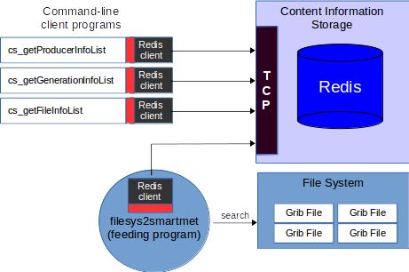

Let's assume that you have the following three grid files stored into the file system and each file contains one grid:

<pre>
  /media/grid-files/test/FMI_20180912T000000_T-K_1200.grib
  /media/grid-files/test/FMI_20180912T000000_T-K_1300.grib
  /media/grid-files/test/FMI_20180912T000000_T-K_1400.grib
</pre>

These files are named so that we can easily recognize the producer ("FMI") and the generation ("20180912T000000") of these files.

For registering these files into the Content Storage, you should execute the following steps.

**STEP 1:**

Start the Redis database so that it uses its default port (6379).  You can do this by giving the following command:

<pre>
  redis-server
</pre>

If you want to start the Redis server in a different port, then you should read the Redis manual in order to find out how this can be done.

**STEP 2:**

Set the following values into the "filesys-to-smartmet.cfg" configuration file:

<pre>

  content-source.producerDefFile             = "%(DIR)/myproducers.csv"
  content-source.directories                 = ["/media/grid-files/test"]
  content-source.patterns                    = ["*.grib"]
  content-source.filenameFixer.luaFilename   = ""
  content-storage.type 			     = "redis"
  content-storage.redis.address              = "127.0.0.1"
  content-storage.redis.port                 = 6379
  content-storage.redis.tablePrefix          = "a."
  debug-log.enabled                          = true
  debug-log.file                             = "/dev/stdout"
</pre>

**STEP 3:**

Create the "myproducers.csv" file and add the following line into it:

<pre>
  FMI;FMI;Finnish Meteorological Institute;Finnish Meteorological Institute;
</pre>

This information is used when a new ProducerInfo record is added iinto the Content Storage.

**STEP 4:**

Run the "filesys2smartmet" program once with the following command:

<pre>
  filesys2smartmet filesys-to-smartmet.cfg 0
</pre>

If everything went well, the Content Storage should now contain one producer record, and generation record, three file records and three content records.

We can check this by using the following commands:

<pre>
  cs_getProducerInfoList 0 -redis "127.0.0.1" 6379 "a."
  cs_getGenerationInfoList 0 -redis "127.0.0.1" 6379 "a."
  cs_getFileInfoList 0 1 3 -redis "127.0.0.1" 6379 "a."
  cs_getContentList 0 1 0 3 -redis "127.0.0.1" 6379 "a."
</pre>

If you want test the same with other grid files or configuration settings, you might want to clear the content of the Redis database first with the following command:

<pre>
  cs_clear 0 -redis "127.0.0.1" 6379 "a."
</pre>

If you want to continue this demo, do not clear the database yet.

Notice that at this stage we can access the Content Storage only by using the Redis implementation of the Content Server API. That's because the SmartMet Server is not running and there are no other communication interfaces available.

The next thing that we could try is to access content information via the CORBA interface. This requires that we start the **"corbaContentServer"** program. We can configure this program so that it only converts CORBA service requests to Redis service requests.

On the other hand, we can configure the program so that it it working as a Caching Content Server. In this case it caches all information stored into the Redis database into its own internal memory structures and all information are fetched from these structures.

In order to use **"corbaContentServer"** we need to execute the following steps:

**STEP 1:**

Set the following values into the  the "corba-content-server.cfg" configuration file:

<pre>
  content-server.address = "127.0.0.1"
  content-server.port = 8200
  content-server.cache.enabled = true
  content-server.iorFile = "/dev/stdout"
  content-server.content-source.type = "redis"
  content-server.content-source.redis.address = "127.0.0.1"
  content-server.content-source.redis.port = "6379"
  content-server.content-source.redis.tablePrefix = "a."
</pre>

**STEP 2:**

Start the **"corbaContentServer"** program with the following command:

<pre>
  corbaContentServer corba-content-server.cfg
</pre>

If everything went well, the program printed its International Object Reference (IOR) into the display. Set this value to the ** SMARTMET_CS_IOR ** environment variable like this:

<pre> export_SMARTMET_CS_IOR="IOR:010000003600000049444c3a536d6172744d65742f436f6e74656e745365727665722f436f7262612f53657276696365496e746572666163653a312e30000000010000000000000068000000010102000a0000003132372e302e302e3100082016000000ff6d7920706f6100436f6e74656e745365727669636500000200000000000000080000000100000000545441010000001c0000000100000001001000100000001000105090101000100000009010100"
</pre>

After that you should be able to access the Caching Content Server by using its CORBA interface with the command-line clients:

<pre>
  cs_getProducerInfoList 0
  cs_getGenerationInfoList 0
  cs_getFileInfoList 0 1 3
  cs_getContentList 0 1 0 3
</pre>

# 4 Data Server

## 4.1 Introduction

In the previous chapter we explained how content information of thousands of grid files can be stored into the Content Storage. This is necessary from a search point of view, which requires that we know which grids are available and where the actual grid files can be found.

This is not enough. We need also to be able to reach those files and access the actual grid data inside them. Technically we could access them if they are stored into a file system that we can reach. In this case we probably would open those files by using some grid libraries (like the SmartMet Grid-Files Library). This is one way to do it, but probably not the smartest.

A smarter way to access grid data in grid files is to access it via the Data Server.

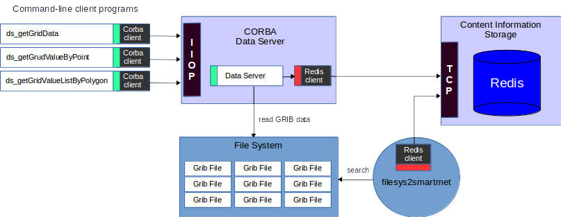

The Data Server controls access to the actual grid files. In practice, the Data Server monitors the Content Storage and this way it knows which grid files should be available. On the other hand, if a grid file is registered into the Content Storage without any actual content information, then the Data Server reads the current grid file and fulfills the content registration into the Content Storage.

Notice that if there are hundreds of thousands grid files or if the sizes of grid files are huge, then it takes a lot of time to read those files and register their content information into the Content Storage. This means in practice, that in bigger real-time systems, the feeding systems should do the content registration at the same time when they add the grid file information into the Content Storage.

The current Data Server implementation maps grid files into the computer's virtual memory so that they can be accessed fast when they are once read into the memory. It is good to realize that when there are tens of thousands memory mapped grid files in the system, operating system limitations might cause some problems. In this case there might be a need to tune some of the operating system parameters, like the maximum number of open files or the maximum number of memory mapped files.

## 4.2 Usage

The basic idea of the Data Server usage is that when we are looking for some information (for example Temperature forecast values for a specific location in a certain time), we first need to first locate the current information by using information stored into the Content Storage. 

As the result of this search, we should find 1) the file identifier (that identifies the grid file) and 2) the message index (that identifies the location inside the grid file). After that we can use the current file identifier and the message index in order to fetch actual grid data from the Data Server.

The Data Server has also the similar Data Server API (marked with green color in the previous figure) as the Content Server has - only the service methods are different. In practice, we can use the Data Server API in order to fetch grid data from the grid files in the following ways:

<pre>
  • Fetching all values in the grid.
  • Fetching values of given grid points.
  • Fetching values according to geographical coordinates. 
  • Fetching values of closest grid points according to geographical coordinates.
  • Fetching grid point values inside areas.
  • Fetching isobands according to geometry definitions and isobands levels.
  • Fetching isolines according to geometry definitions and isoline levels.
</pre>

The Data Server API methods can also take 2 or 4 fileId-messageIndex pairs as an input.

For example, if a user wants a grid values/isobands/isolines from a specific time, but we do not have data exactly from the requested time. In this case we search two grids which times are closest to the requested time and after that we interpolate their values according to the given time interpolation method.

If the user requests a specific level that we do not have then we search grids with the closest levels and interpolate their values according to the given level interpolation method. We need 4 fileId-messageIndex pairs when the user request both the time and the level that we not not have. In this case we have to find the grids that have closest times and the closest levels and do the necessary interpolations.

The basic assumption is that the current Data ServerAPI will be expanded in future quite much. For example, if we want to find out minimum, maximum or mean values of a grid, it does not make sense to fetch the whole grid data from the Data Server.  Instead, we can implement service methods that returns these values.

The point is that the grid data can be handled in many ways, but the size of this data is usually so big, that it is quite heavy operation to move it around. That's why we should fetch only data that we need.

Currently there are only three implementations of the Data Server API:

1. The actual Data Server implementation that can access grid files in the file system. It is important to understand that this implementation needs to access to the actual file system. For example, if this implementation is used in the SmartMet Grid Engine, then grid files must be found from the file system, which is visible for the current SmartMet Server.

2. The CORBA client implementation allows the remote usage of the actual Data Server. For example, the previous figure shows how command-line client programs are able to access the Data Server that is located into another computer.

3. The Caching Data Server implementation can be used for caching information that was recently fetched from the Data Server. For example, if the actual Data Server is a remote server, then the client side might contain the Caching Data Server implementation. This implementation is not fully complete yet. In other words, it caches only some parts of the information meanwhile quite many of the service requests just go through it.

Remote usage of the Data Server makes sense when there are several systems that want to access the same grid files.

As was mentioned earlier, the Data Server maps grid files into the virtual memory. It each system uses the Data Server locally then the Data Server uses their virtual memory. However, if the current systems do not have much physical memory, then the Data Server cannot access grid files very fast, because older information is continuously swapped out of the physical memory.

On the other hand, if there is one Data Server running in a computer that have a lot of physical memory, then more grid files can be in the physical memory at the same time. That's why it is much faster for other systems to fetch grid information from the Data Server that has a lot of physical memory and which has already memory mapped most of the grid files than to use own memory mappings with limited amount of physical memory.

## 4.3 Virtual Grid Files

The current implementation of the Data Server supports creation of virtual grid files. In practice, virtual grid files are grid files that can be mathematically generated from physical grid files.

For example, we might have a grid file that contains temperature values expressed in Kelvins, but we need the same temperature values expressed in Celsius. In this case the Data Server can create a virtual grid file and register it into the Content Storage. When we request data from the current virtual from the Data Server, it reads the requested temperature information from the physical grid file (where temperature values are expressed in Kelvins) and converts this information into Celsius. values before temperature values are returned.

The biggest benefit of this arrangement is that virtual filed do not require any space, because they use data from other grid files. The current information supports virtual file creation from one or two source files. For example, if we have wind speed expressed in U- and V- vector values (i.e. we have two grids), we can create a virtual grid file that uses both of these files for calculating the total wind speed.

Unfortunately, this is a little bit complex operation from the Data Server point of view, which means that it should not necessary be used in very busy environments (i.e. when there are tens of thousands continuously changing grid files). The difficulty is that if we are using two different grid files for generation a virtual file, we cannot just pick any two grid files. In other words, they both need to have the same producer, they need to belong to the same generation, their forecast time, geometry, level type, level, etc. must match each other.

## 4.4 Data Server API

### 4.4.1 Introduction

The Data Server API contains a lot of service methods, which allows us an easy access to millions of grids that might be in millions of grid files. It is important to understand that when using the Data Server API you should know which grid files you want to access i.e. you should know the grid file id and the message index in order find the correct grid. 

As was mentioned earlier, this information can be found from the Content Server. For example, if you are looking for a temperature grid for certain time, then you should first call the Content Server API in order to search correct grid files. After that you can call the Data Server API services in order to fetch the actual grid data. 

### 4.4.2 Interpolation

When you are requesting data from the Data Server, you should define a point or an area where you want to fetch the data. For example, you might define this by latitude-longitude coordinates. 

If the given coordinates do not match to exact grid points, the Data Server might calculate the requested value by interpolating values from the closest grid points. On the other hand, the Data Server might also select value from the closest grid point, or pic the maximum/minimum value from the surrounding grid points. The selection depends on “the area interpolation method” that was delivered in the current request.

If the grid time does not exactly match to the requested time, the Data Server might calculate the requested value by interpolating two closest grids. In this case, the request usually contains two grids, requested time and “the time interpolation method”.

If the grid level does not exactly match to the requested level, the Data Server might calculate the requested value by interpolating two closest grids. In this case, the request usually contains two grids, requested level and “the level interpolation method”.

If the grid level and the time does not match to the requested level and time, the Data Server might calculate the requested value by interpolating four closest grids. 

### 4.4.3 Service methods

#### Single data points

The simplest way to fetch data from the Data Server is to fetch data from a single point of the grid. Single data points can be accessed through the Data Server API by the following methods:

<pre>
  • getGridValueByPoint
  • getGridValueByLevelAndPoint
  • getGridValueByTimeAndPoint
  • getGridValueByTimeLevelAndPoint
</pre>

#### List of data points

It is much more efficient to fetch data from multiple grid points at the same time than fetch data separately for each point. Multiple data points can be accessed through the Data Server API by the following methods:

<pre>
  • getGridValueListByPointList
  • getGridValueListByLevelAndPointList
  • getGridValueListByTimeAndPointList
  • getGridValueListByTimeLevelAndPointList
</pre>

#### Point data inside an area

Sometimes we want to fetch grid points from inside a given area. For example, we might have a city border (= list of polygon coordinates) that defines the wanted grid area. In this case we fetch grid points inside this area. It is also possible that we have only the center coordinates and a radius of an area, which means that we are fetching grid points inside a circular area.

When fetching grid data from inside an area, the Data Server does not do any area interpolation, because we are fetching the actual grid points. However, the Data Server might do time and level interpolation if this is requested. 

The following methods can be used in order to fetch grid points from inside a given area:

<pre>
  • getGridValueListByCircle
  • getGridValueListByPolygon
  • getGridValueListByPolygonPath
  • getGridValueListByLevelAndCircle
  • getGridValueListByLevelAndPolygon
  • getGridValueListByLevelAndPolygonPath
  • getGridValueListByRectangle
  • getGridValueListByTimeAndCircle
  • getGridValueListByTimeAndPolygon
  • getGridValueListByTimeAndPolygonPath
  • getGridValueListByTimeLevelAndCircle
  • getGridValueListByTimeLevelAndPolygon
  • getGridValueListByTimeLevelAndPolygonPath
</pre>

#### Vector data

The following methods can be used in order to fetch grid data as vectors:

<pre>
  • getGridValueVector
  • getGridValueVectorByCoordinateList
  • getGridValueVectorByGeometry
  • getGridValueVectorByRectangle
  • getGridValueVectorByLevel
  • getGridValueVectorByLevelAndCoordinateList
  • getGridValueVectorByLevelAndGeometry
  • getGridValueVectorByTime
  • getGridValueVectorByTimeAndCoordinateList
  • getGridValueVectorByTimeAndGeometry
  • getGridValueVectorByTimeAndLevel
  • getGridValueVectorByTimeLevelAndGeometry
  • getGridValueVectorByTimeLevelAndCoordinateList
</pre>

#### Isobands

The following methods can be used in order to fetch grid data as isobands (=> WKB format):

<pre>
  • getGridIsobands
  • getGridIsobandsByGeometry
  • getGridIsobandsByGrid
  • getGridIsobandsByLevel
  • getGridIsobandsByLevelAndGeometry
  • getGridIsobandsByLevelAndGrid
  • getGridIsobandsByTime
  • getGridIsobandsByTimeAndGeometry
  • getGridIsobandsByTimeAndGrid
  • getGridIsobandsByTimeAndLevel
  • getGridIsobandsByTimeLevelAndGeometry
  • getGridIsobandsByTimeLevelAndGrid
</pre>

#### Isolines

The following methods can be used in order to fetch grid data as isolines (=> WKB format):

<pre>
  • getGridIsolines
  • getGridIsolinesByGeometry
  • getGridIsolinesByGrid
  • getGridIsolinesByLevel
  • getGridIsolinesByLevelAndGeometry
  • getGridIsolinesByLevelAndGrid
  • getGridIsolinesByTime
  • getGridIsolinesByTimeAndGeometry
  • getGridIsolinesByTimeAndGrid
  • getGridIsolinesByTimeAndLevel
  • getGridIsolinesByTimeLevelAndGeometry
  • getGridIsolinesByTimeLevelAndGrid
</pre>

## 4.5 Getting started

Let's assume that you managed to get the Redis content server and also the CORBA Content Server up and running as was described in the previous chapter. The next step is to start the CORBA Data Server, so that we can remotely access its services.

Notice that this is something that we do not necessarily need to do when the Data Server is used as a part of the Grid Engine. However, the purpose of this demo is to show how easy it is to use a remote Data Server.

So, the start situation of this demo is that:

1. We have Redis database running.
2. We have registered three grid files into the Content Storage (i.e. to Redis database).
3. We have corbaContentServer running and its service IOR is saved to the ** SMARTMET_CS_IOR **
    environment variable.

In order to start the remote Data Server, we should execute the following steps:

**STEP 1:**

Set the following values into the "corba-data-server.cfg" configuration file:

<pre>
  data-server.address = "127.0.0.1"
  data-server.port = 8201
  data-server.iorFile = "/dev/stdout"
  data-server.content-source.type = "$(SMARTMET_CS_IOR)"
  data-server.grid-storage.directory = ""
</pre>

**STEP 2:**

Start the "corbaDataServer" program with the following command:

<pre>
  corbaDataServer corba-data-server.cfg
</pre>

If everything went well, the program printed its International Object Reference (IOR) into the display. Set this value to the ** SMARTMET_DS_IOR ** environment variable like this:

<pre>
export_SMARTMET_DS_IOR="IOR:010000003600000049444c3a53432172744d65742f43665432788654243af43465722f436f7262612f53657276696365496e746572666163653a312e30000000010000000000000068000000010102000a0000003132372e302e302e3100082016000000ff6d7920706f6100436f6e74656e745365727669636500000200000000000000080000000100000000545441010000001c00000001000000010001000100000001000105090101000100003218993214"
</pre>

After that you should be able to access the Data Server by using its CORBA interface with the command-line client programs. However, you should probably first ask from the Content Storage what kind of grid information is available. You can do this for example by the following command.

<pre>
  cs_getContentList 0 1 0 10
</pre>

Now you can request information from the actual grid files. In practice you identify the grid file by using the grid file identifier that you fetched from the Content Storage. A grid file can contain several grids. That's why you need to identify the grid inside the current file by using the message index that you received from the Content Storage. In addition, you have to define the location (= location in the grid or geographical location) of the grid point which value you want to ask.

For example, you can ask the value of a specific grid point by using the following command-line client program:

<pre>
  ds_getGridValueByPoint <sessionId> <fileId> <messageIndex> <flags> <coordinateType> <x> <y> <interpolationMethod>
</pre>

The "flags" parameter is reserved for future use. The "coordinateType" parameter can have one of the following values:

<pre style="background:#A0E0E0;">
  1     The point location (x,y) is expressed in longitudes (=x) and latitudes (=y).
  2     The point location (x,y) is expressed in grid xy-coordinates.
  3     The point location (x,y) is expressed by using the original projection coordinates (gaussian,lambert, etc)
</pre>

The "interpolationMethod" parameter can have one of the following values:

<pre>
  1	 Linear interpolation
  2	 Nearest value (= the value of the closest grid point)
  3	 Minimum value (= the smallest value of surrounding four greed points)
  4	 Maximum value (= the biggest value of surrounding four greed points)
  500	 Values of the closest four points and the relative position of the requested point.
  501	 Values and angles of the closest four points and the relative position of the requested point.
</pre>

For example, the following command fetches the value of the grid point (25,43) from the grid "1" located in the grid file "123". The returned value is not interpolated.

<pre>
  ds_getGridValueByPoint 0 123 1 0 2 25 43 2
</pre>

On the other hand, we could fetch values from the same grid by using latlon coordinates and use linear interpolation:

<pre>
  ds_getGridValueByPoint 0 123 1 0 1 23.80 65.20 1
</pre>

# 5 Query Server

## 5.1 Introduction

The Query Server offers a simple way to query information from grid files. In practice, it uses the Content Server and the Data Server in order to fetch the requested data.

Technically it is very easy to fetch data even without the Query Server. However, this is the case only when we know exactly what we are looking for. In order to create an exact query, we need to define the following query parameters:

<pre >
  1. Producer (who is the producer of the requested data)
  2. Generation (which generation we should use)
  3. Parameter (which forecast parameter we are looking for)
  4. Level type (the level type used to indicate parameter levels)
  5. Level (the level value in the given level type)
  6. Forecast type and number
  7. Geometry (which grid geometry we should use if there are several geometries available)
  8. Forecast time (time or time range of the requested data)
  9. Location (the coordinates of the requested data)
</pre>

Unfortunately, most of the queries contain only part of this information. That's why the most important functionality of the Query Server is to fulfill incomplete queries before fetching any data. This fulfilling is based on several configuration files.

On the other hand, it is good to realize that the Query Server is used for fetching information from geographical points or areas rather than plain grid points. This means in practice that when searching grids, the Query Server needs to check that the grid covers the requested geographical points or areas. In order to do that each grid must have a geometry identifier that can be used for fetching the actual geographical information about the area that the current grid covers.

The Query Server is used from the timeseries plugin and the WFS plugin. This means in practice, that their queries are fulfilled and executed in the same way. So, the query logic should not be a part of the plugin itself.

## 5.2 Query parameters

The Query Server support query parameters that can contain more detailed information about the requested parameters than the query parameters used earlier with the Timeseries Plugin. Instead of using the same global attributes (like producer, level, origintime, etc.) for each query parameter, we can define these attributes separately for each query parameters. In this way we can for example query temperature values from the different producers at the same time. When using the Timeseris plugin we can fetch temperature value from three different producers like this:

<pre>
  http://smartmet.fmi.fi/timeseries?place=helsinki&param=TIME,T-K:SMARTMET,T-K:HL2,T-K:ECG
</pre>

And the result would be something like this:

<pre>
  TIME              T-K:SMARTMET    T-K:HL2     T-K:ECG 
  20180917T110000   286.9           287.4       285.8
  20180917T120000   287.3           287.7       286.6
</pre>

We can also query parameters from different levels:

<pre>
  http://smartmet.fmi.fi/timeseries?place=helsinki&param=TIME,T-K:HL2::6:0,T-K:HL2::6:2
</pre>

The result shows temperatures from heights 0m and 2m:

<pre>
  TIME            T-K:HL2::6:0    T-K:HL2::6:2 
  201809181400    288.3           288.6
  201809181500    288.1           288.6
</pre>

A query parameter can contain the following fields (separated by ':' character):

<pre>
  1.  Parameter name
  2.  Producer name
  3.  Geometry identifier
  4.  Level identifier
  5.  Level
  6.  Forecast type
  7.  Forecast number
  8.  Generation flags
  9.  Area interpolation method
  10. Time interpolation method
  11. Level interpolation method
</pre>

If these fields are not defined then the Query Server tries to find the closest matching parameter from the mappings files, which are described a little bit later.

Query parameters can also contain functions that can for example calculate different values according to their parameters. For example, we can use the "SUM" function for converting Kelvin temperature values into Celsius. values:

<pre>
  http://smartmet.fmi.fi/timeseries?place=helsinki&param=TIME,T-K,SUM{T-K;-273.16}
</pre>

The request returns as two temperature values. The first value is the original Kelvin value, the second value is converted from the Kelvin by using the "SUM" function. This function just add all its parameters together. So, when we add "-273.16" to a Kelvin value, we get a Celsius value.

<pre style="background:#E0E0E0;">
  TIME                T-K         SUM{T-K;-273.16}
  20180917T140000     287.8       14.7
  20180917T150000     288.0       14.9
</pre>

The current function is defined in a configuration file by using LUA programming language. The function takes a list of float numbers as an input, counts the sum of these numbers, and returns the result.

<pre>
  function SUM(numOfParams,params)
    local result = {};  
    if (numOfParams > 0) then   
      local sum = 0;
      for index, value in pairs(params) do
        if (value ~= ParamValueMissing) then
          sum = sum + value;
        else
          result.message = 'OK';
          result.value = ParamValueMissing;
          return result.value,result.message;
        end
      end
      result.message = 'OK';
      result.value = sum;
    else
      result.message = 'No parameters given!';
      result.value = 0;  
    end   
    return result.value,result.message;
  end
</pre>

LUA functions can also return for example text strings according to the value of the requested parameter. For example, we can express wind directions in degrees or in text:

<pre>
  http://smartmet.fmi.fi/timeseries?place=helsinki&param=TIME,WindDirection,NB_WindCompass16{WindDirection}
</pre>

<pre>
  TIME            WindDirection   NB_WindCompass16{WindDirection}
  201809181600    240.2           WSW
  201809181700    230.2           SW
</pre>

This means that we can easily express all possible parameter values in text if we want to do so. This gives us a lot of new opportunities to textually describe different weather parameters by using multiple languages. The point is that these definitions are not hard-coded as they were in older versions. We can use new parameters and created new expressions just by editing LUA files.

We can use the same LUA functions also when requesting data over geographical areas. When we are requesting values from an area, we usually get several values per time-step.

<pre>
  http://smartmet.fmi.fi/timeseries?area=turku&param=TIME,T-K
</pre>

<pre>
  TIME            T-K
  201809181500    [288.4 288.5 288.6 288.6]
  201809181600    [288.8 288.9 288.8 288.7]
</pre>

If we want to make calculations over these values, we need to use '@' character in the front of the LUA function name. In this way the Query Server understands that the current value list should be delivered to the requested function as a list of float values.

For example, the following request contains three of this kind of function.

<pre>
  http://smartmet.fmi.fi/timeseries?area=turku&param=TIME,T-K,@AVG{T-K},@MIN{T-K},@MAX{T-K}
</pre>

And the result would look like this:

<pre>
  TIME            T-K                         @AVG{T-K}   @MIN{T-K}   @MAX{T-K}
  201809181500    [288.4 288.5 288.6 288.6]   288.5       288.4       288.6
  201809181600    [288.8 288.9 288.8 288.7]   288.8       288.7       288.9
</pre>

In practice, we can define as many LUA functions as we want and use them in our queries. These functions are defined in LUA files, which are automatically loaded in use when they are changed. No restart is needed. The locations of LUA files are defined in the main configuration file (of the Grid Engine or the Query Server). If LUA files are edited, they will be automatically loaded without any restart of the system.

The new version of the timeseries plugin supports also queries that return isoline and isoband contours, which can be easily merged into the same image. The figure below shows how pressure isolines, temperature isobands and land borders (=isolines) are merged into the same image.

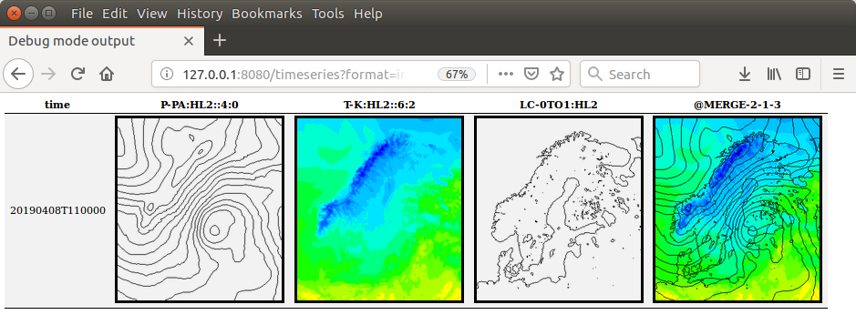

In this case the query looks like this.

<pre>
  http://smarmet.fmi.fi/timeseries?format=image&places=Helsinki&param=time,ISOLINES:95000;0;95200;0;95400;0;95600;0;95800;0;96000;0;96200;0;96400;0;96600;0;96800;0;97000;0;97200;0;97400;0;97600;0;97800;0;98000;0;98200;0;98400;0;98600;0;98800;0;99000;0;99200;0;99400;0;99600;0;99800;0;100000;0;100200;0;100400;0;100600;0;100800;0;101000;0;101200;0;101400;0;101600;0;101800;0;102000;0;102200;0;102400;0;102600;0;102800;0;103000;0;103200;0;103400;0;103600;0;103800;0:P-PA:HL2::4:0,200;00005f;242;00007f;244;00009f;246;0000bf;248;0000df;250;0000ef;252;0500ff;254;0300ff;256;0100ff;258;0002ff; 260;0022ff;262;0044ff;264;0064ff;266;0084ff;268;00a4ff;270;00c4ff;272;00e4ff;274;00ffd0;276;00ff83;278;00ff36;280;17ff00;282;65ff00;284;b0ff00;286;fdff00;288;FFf000;290;FFdc00;292;FFc800;294;FFb400;296;FFa000;298;FF8c00;300;FF7800;302;FF6400;304;FF5000;306;FF3c00;308;FF2800;310;FF1400; 312;FF0000;314;FF0020;316;FF0040;318;FF0060;320;FF0080;400;FF0EF0:T-K:HL2::6:2,ISOLINES:0.5;0:LC-0TO1:HL2,@MERGE-2-1-3&timesteps=1&geometryId=1073
</pre>

Technically the current query defines values and colors (RGB) for each isoline / isoband. In addition, it defines the geometry that should be used for the contours. The place parameter is used in this case only for getting a correct time-zone for the time parameters.

As can be seen, isoline / isoband queries are quite long. Luckily the new version of the timeseries plugin supports the usage of alias definitions in the query parameters. So, we can replace some parts of the query with aliases (which values are defined in alias files).

<pre>
  http://smartmet.fmi.fi/timeseries?format=image&places=Helsinki&param=time,$(IL_PA):P-PA:HL2::4:0,$(IB_K):T-K:HL2::6:2,ISOLINES:0.5;0:LC-0TO1:HL2,@MERGE-2-1-3&timesteps=1&geometryId=1073
</pre>

Actually, we can replace all query parameters with a single alias:

<pre>
  http://smartmet.fmi.fi/timeseries?format=image&places=Helsinki&param=$(IDEMO)&timesteps=1&geometryId=1073
</pre>

Timeseries can load alias definitions from multiple alias files. The names of the alias files are defined in the timeseries configuration file. Notice that these alias definitions are replaced with their values in the timeseries plugin, before the plugin calls the query server. I.e. these aliases are used only with the timeseries plugin (not with other plugins).

## 5.3 Configuration

The Query Server can be used as an independent server, but usually it is used as an embedded part of the SmartMet Grid Engine. That's why the configuration file of the SmartMet Grid Engine usually contains a lot of Query Server related configuration parameters.

The usage and configuration of the grid-engine is described in the “grid-engine.pdf” document. This document also describes the configuration of the Query Server. 

# 6 SmartMet Server

## 6.1 Introduction

So far, we have introduced four main components used by the grid support. These components are:

<pre>
  • Grid-Files Library
  • Content Server
  • Data Server
  • Query Server
</pre>

In spite of that these components are developed in the SmartMet project, they do not necessary need SmartMet Server. However, if someone wants to use these components, he/she most likely want to use them via SmartMet Server's user-friendly interfaces (Timeseries, Grid-GUI, WFS, etc.) rather than via programming interfaces that these components are offering.

The figure below shows the basic configuration of the SmartMet Server using the grid support.

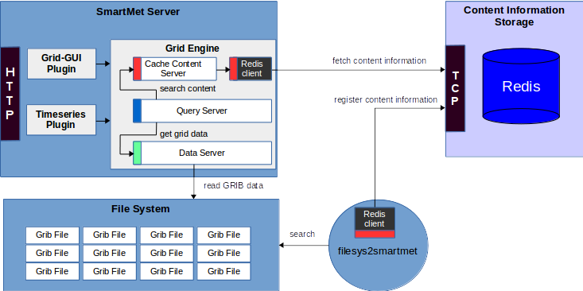

In this configuration there is an external Content Storage (= Redis database) that contains the grid content information, meanwhile the actual grid information management is concentrated into the Grid Engine. In other words, the (Caching) Content Server, the Data Server and the Query Server are embedded into the Grid Engine.

This is the main reason why most of the configuration parameters we described in previous chapters are actually found from the Grid Engines configuration file. When using this kind of configuration, also the grid files must be visible to the Grid Engine (i.e. the file system must be mounted so that the Grid Engine can access it.

## 6.2 Architecture

Technically the grid support consists of a collection of flexible components that can be embedded into existing systems or be used as separate components. These components can be easily distributed and replicated, which makes the system real scalable. This does not require any programming. It requires only some tuning of configuration files.

For example, usually there is just one Content Storage in the system (and maybe some kind of backup). If there are a lot of continuous information updates going on (= millions of updates per day) and several SmartMet Server instances are polling these updates directly from the Redis Content Server, the load of this component can increase into quite high level.

In this case, the feeding systems (filesys2smartmet, radon2smartmet, etc.) are competing the usage of the same resources, which might slow down them all. In the worst-case scenario, the feeding systems do not get enough time in order to make required content information updates into the Content Storage. Because of this, the SmartMet Server components are trying to access grid files that were already removed from the system.

That's not a real problem, because the grid support is designed to be extreme scalable. The figure below shows how a Caching Content Server can be installed in the front of the Content Storage. In this way we can easily reduce the load of Content Storage and make sure that the feeding systems get enough time in order to make required content information updates into the Content Storage.

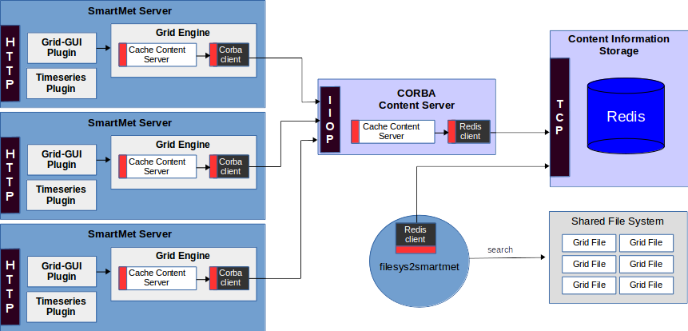

In the figure above, also the Grid Engines have Caching Content Server, which allows them to make fast queries to the content information.

The Caching Content Server is implemented so that all modification requests go through it. For example, if we send a request for adding a new FileInfo record to the Caching Content Server, it automatically forwards this request to the Master Content Server (=> Redis implementation), which adds the new record into the Redis database. In this case the Caching Content Server does not necessary immediately see the addition, because it takes few seconds before it gets this information from the Master Content Server.

As was mentioned earlier, all grid support components are distributable. On the other hand, they are also accessible by other components and systems. 

For example, Java applications could directly use the grid support services by calling the CORBA/IIOP service interfaces. This is shown in the figure below.

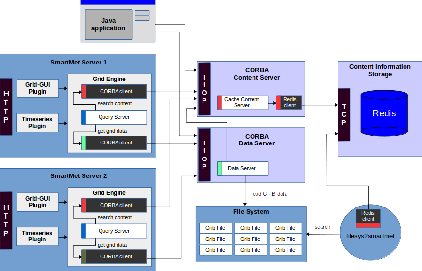

In this configuration, two SmartMet Servers are just similar users from grid services point of view than the Java Application.

This approach is typical for Service Oriented Architectures (SOA). This means in practice that we have a collection of services that everybody can use. Ability to use these kinds of services should not depend on the programming language (C, C++, Java, Python, etc.) or the usage environment (Linux, JRE, Windows, etc.).

## 6.3 Grid Engine

### 6.3.1 Introduction

The Grid Engine allows SmartMet Plugins to access services related to the grid support. This means in practice that they can access information stored into the Content Storage by using the Content Server API, fetch grid data from the grid files by using the Data Server API or make queries by using the Query Server API.

All these APIs can be found from the Grid Engine. At the moment the following plugins are using the Grid Engine and its services:

<pre>

  • Timeseries
  • WMS
  • WFS
  • Download Plugin
  • Cross-Section
  • Grid-GUI
  • Grid-Admin

</pre>

### 6.3.2 Documentation

The configuration of the grid engine is described in the “grid-engine.pdf” document.

## 6.4 Grid-GUI Plugin

### 6.4.1 Introduction

The Grid-GUI Plugin can be used in order to visualize grid files, which information is registered into the Content Storage. Originally this plugin was created in order to help the development work in the grid support project. In other words, we just wanted to see that our key components were working correctly and they can open different kinds of grid files and support multiple projections. In addition, it offered us a nice way to see almost all information that was stored into the Content Storage.

We noticed that the Grid-GUI was very useful and that's why we decided to publish it. However, it is good to understand that this is a very special tool and it was not originally designed for very wide use. In other words, in spite of that this GUI is quite functional, we could develop even better GUIs if we had more time for this. In practice, this GUI demonstrates some of the capabilities that the grid support brings to developers.

The figure below shows the basic outlook of the Grid-GUI.

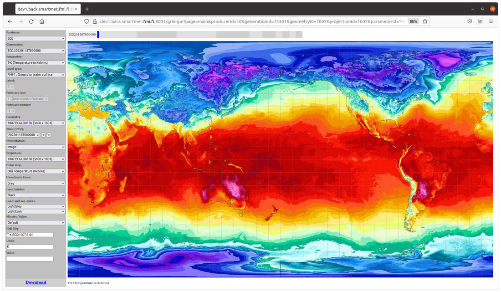

### 6.4.2 Visualization

The basic idea of the visualization is that we imagine grids to be two dimensional images that contain different colors. I.e. grid values can be changed to colors. For example, if we have a grid that contains wind speed values, we can convert these values to colors so that bigger values (= strong wind) are converted to darker colors and smaller values (= weak wind) are converted to lighter colors.
 
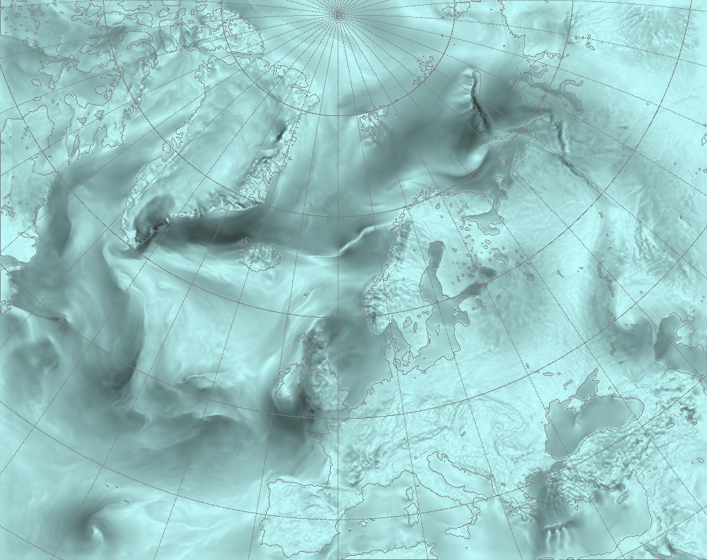  

On the other hand, we can define actual color mappings for some grid values. In this case we need to use configuration files where different value ranges are mapped into different colors. The figure below shows, how different temperature values are mapped into different colors.

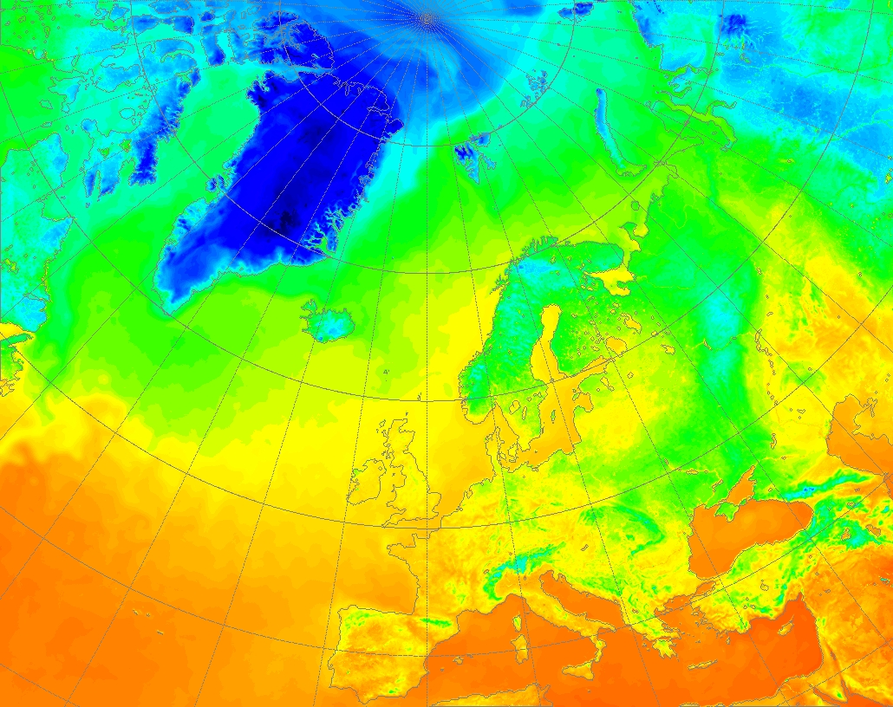

We have added continental borders and coordinate lines in the previous images. These help us to geographically locate the current grid information. In some cases this is not enough. For example, a grid can be from an area where no recognizable borders are available. In this case we can draw the grid into the world map and this way see its geographical location.

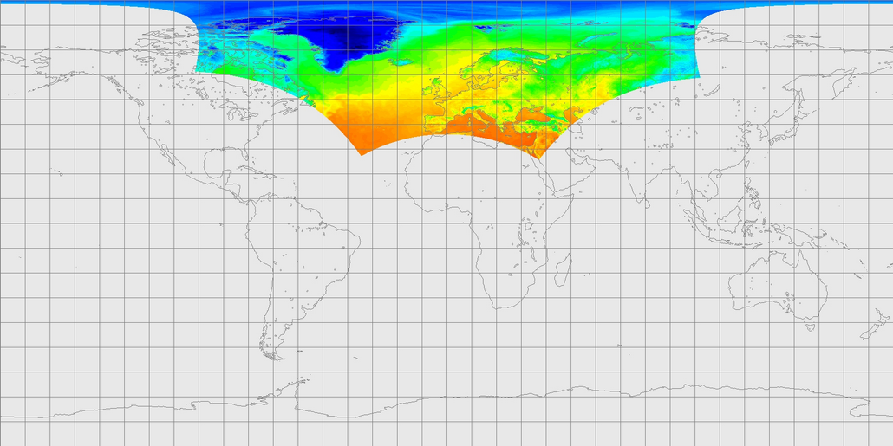

If a grid contains some kind of state of symbol values, we can map these values into actual symbols. We can also define locations for these symbols. For example, we can locate symbols so that they cover all the main cities. In future, we are probably doing the same thing with numbers (for example, showing temperature values in selected locations).

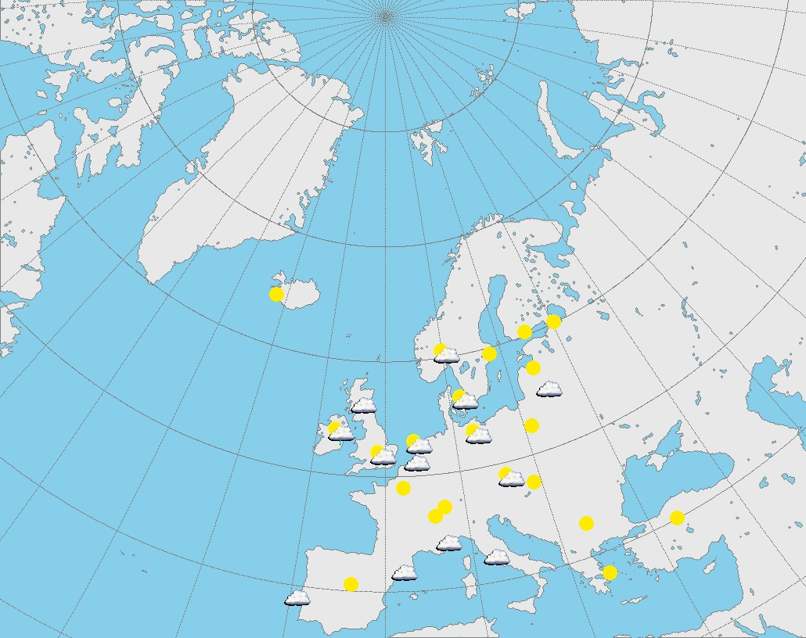

### 6.4.3 Configuration

The main configuration file of the Grid-GUI Plugin is read once when the server is started. The main configuration file of the SmartMet Server should point to this file.

The configuration file contains a lot of references to other files (color maps, symbol maps, locations, etc.) these files are dynamical configuration files, which are loaded in use automatically if they change. Unfortunately, we can only update these files without restart, but if we want to add new color maps, symbols maps or locations files, we have to restart the system. This is something that we should change in future.

A typical Grid-GUI Plugin configuration file looks like this:

<pre>
  smartmet :
  {
    plugin :
    {
      grid-gui :
      {
 	# We are using the Grid-Files Library. In order to use it, we need to initialize it first. That's why need to know the location
	# of its main configuration file
.
	grid-files :
	{	
	  configFile = "/smartmet/config/library/grid-files/grid-files.conf"
	}

	# The land-sea-mask JPG file. This file is used in order to find out if a grid point is over the land or over the sea. This map 
	# covers the whole globe, but it is not very accurate. For example, if the grid covers only a small geographical area then 
	# the land border would be quite rough.

	land-sea-mask-file = "%(DIR)/land-sea-mask.jpeg"

	# File that contain color name and value definitions, which are shown in the color value lists (for land border, land/sea mask, etc.)

	colorFile = "%(DIR)/colors2.csv"

	# Color mapping files. These files are used for mapping grid values to actual colors. Notice that the same mappings files can 
	# be used for multiple purposes. That's why, we should be able to reference these values with multiple names. These names 
	# are defined in the beginning of these files and they are visible in the Color Map selection list.

	colorMapFiles :
	[
	  "%(DIR)/colormaps/values_-33_to_68.csv",
	  "%(DIR)/colormaps/values_240_to_341.csv",
	  "%(DIR)/colormaps/values_0_to_1.csv",
	  "%(DIR)/colormaps/values_0_to_10.csv",
	  "%(DIR)/colormaps/values_0_to_100.csv",
	  "%(DIR)/colormaps/values_-42_to_42.csv"
        ]

	# Symbol mapping files. These files are used for mapping grid values to symbols. It is quite common that there are multiple 
	# files for same symbols. In this case only symbol sizes are different.

	symbolMapFiles :
	[
	  "%(DIR)/symbolmaps/weather-hessaa-30.csv",
	  "%(DIR)/symbolmaps/weather-hessaa-40.csv",
	  "%(DIR)/symbolmaps/weather-hessaa-50.csv",
	  "%(DIR)/symbolmaps/weather-hessaa-60.csv",
	]

	# When using symbols or showing single values we need to define locations which to use. For example, we might want to show
	# symbols so that they cover the main cities in the area. That's why we can define location lists, which contain location names
	# and coordinates. These lists are defined in separate location files.

	locationFiles :
	[
	  "%(DIR)/locations/europe-main-cities.csv",
	  "%(DIR)/locations/finland-main-cities.csv"
	]

	# On the top of the Grid-GUI there is a gray block that can be used for changing images fast. This is quite nice feature, 
	# but from the server's point of view this kind of animation is quite heavy operation. That's why it not necessary allowed when
	# there are a lot of users. This animation feature can be enabled or disable by this parameter:

	animationEnabled = true

	# The Grid-GUI caches some of the images that it generates. This is especially important when the animation feature is used.
	# The following parameters define the cache location and its size limits.

	imageCache :
	{
	  # Image storage directory
	  directory = "/tmp/"
  
	  # Delete old images when this limit is reached
	  maxImages = 1000
  
	  # Number of images after the delete operation
	  minImages = 500
	}
      }
    }
  }

</pre>

## 6.5 Grid-Admin Plugin

### 6.5.1 Introduction

The Grid-Admin Plugin is a simple plugin that offers an HTTP interface to the Content Storage. So, technically other system (for example, feeding systems) can use this interface for updating and fetching content information from the Content Storage

The Grid-Admin Plugin does not use the Grid Engine. Instead, it connects directly to the Content Server by using its own configuration information.

### 6.5.2 Configuration

The main configuration file of the Grid-Admin Plugin is read once when the server is started. The main configuration file of the SmartMet Server should point to this file.

The configuration file look like this:

<pre>
  grid-admin :
  {
    content-server :
    {
      # Content server type (redis / corba / http).
      type = "redis"

      # These parameters must be updated when the content server type is "redis".

      redis :
      {
        address     = "127.0.0.1"
        port        = 6379
        tablePrefix = "a."
      }

      # These parameters must be updated when the content server type is "corba".

      corba :
      {
        ior = "$(SMARTMET_CS_IOR)"
      }

      # These parameters must be updated when the content server type is "http".

      http :
      {
        url = "http://smartmet.fmi.fi/grid-admin"
      }
    }
  }
</pre>

