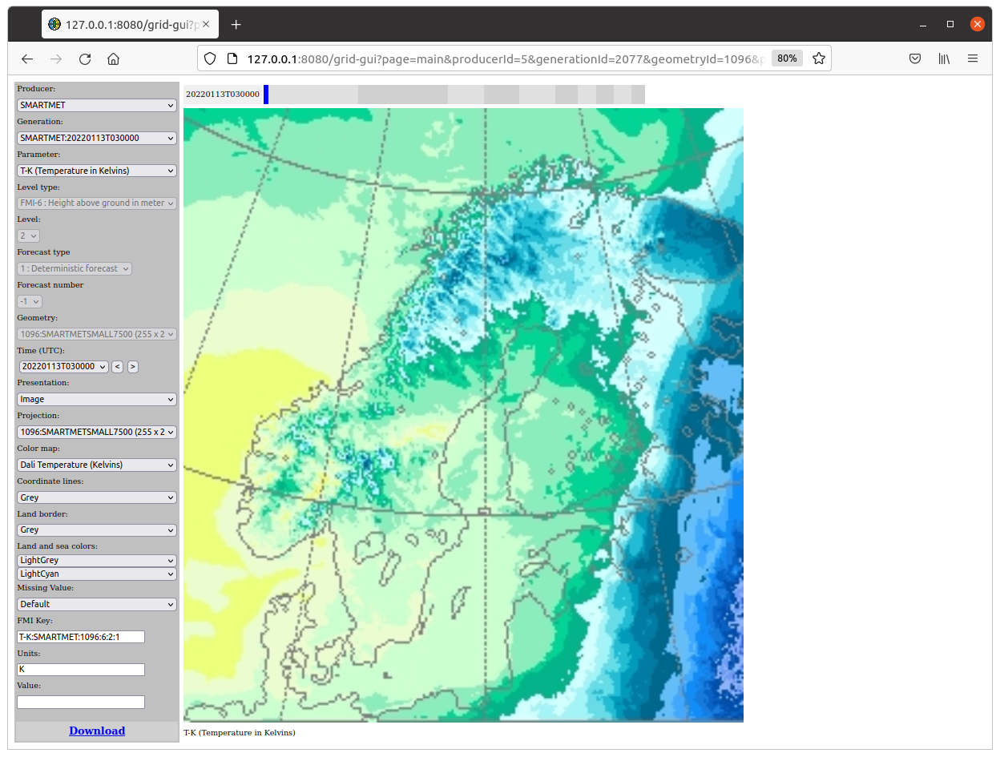

**Finnish Meteorological Institute / SmartMet Server / 2022-01-18**

# QUICK SETUP

# TABLE OF CONTENTS

<ul>
  <li><a href="#chapter-1">1 QUICK SETUP</a>
  <ul>
    <li><a href="#chapter-1-1">1.1 Purpose</a>
    <li><a href="#chapter-1-2">1.2 Requirements</a>
    <li><a href="#chapter-1-3">1.3 Phases</a>
    <ul>
      <li><a href="#phase-1">PHASE 1: Parameter recognition and mapping</a>
      <li><a href="#phase-2">PHASE 2: Filling the Content Storage</a>
      <li><a href="#phase-3">PHASE 3: Checking grid information</a>
      <li><a href="#phase-4">PHASE 4: Querying grid information</a>
      <li><a href="#phase-5">PHASE 5: Problem solving</a>
    </ul>
  </ul>
</ul>

 

# 1 QUICK SETUP

## 1.1 Purpose

The purpose of this document is to describe a quick setup for the
SmartMet Server so that it can use grid-files (GRIB1, GRIB2, NetCDF,
QueryData) for its timeseries queries.

## 1.2 Requirements

In this quick setup we expect that the following requirements are
fulfilled before the setup is started:

1.  The latest versions of the SmartMet components and configuration
    files are installed. 
2.  Redis server is running and accessible (locally or remotely) and its
    address and port is known.
3.  The current filesystem contains a directory that contain valid grid
    files.

## 1.3 Phases

This quick setup is divided into the following phases:

<ul>
<li><a href="#phase-1">1. Parameter recognition and mapping</a>
<li><a href="#phase-2">2. Filling the Content Storage</a>
<li><a href="#phase-3">3. Checking grid information</a>
<li><a href="#phase-4">4. Querying grid information</a>
<li><a href="#phase-5">5. Problem solving</a>
</ul>

### PHASE 1: Parameter recognition and mapping

The first thing to do is to make sure that the system can recognize
parameters in our grid files. The easiest way to test this is to use
"**grid\_dump**" application, which prints the content of the given grid
file. This application belongs to the <a href="https://github.com/fmidev/smartmet-tools-grid">"smartmet-tools-grid"</a> package.

The current application needs to know the location of the main
configuration file used by the <a href="https://github.com/fmidev/smartmet-library-grid-files/blob/master/doc/grid-files.md">“smartmet-library-grid-files”</a> module 
(which is responsible for extraction of grid files). This location is
given in the environment variable “**SMARTMET\_GRID\_CONFIG\_FILE**”.
You can define this by the following command.

<pre>
  export SMARTMET_GRID_CONFIG_FILE~=/usr/share/smartmet/grid-files/grid-files.conf
</pre>

After that you should be able to execute the “**grid\_dump**”
application (this is usually located in “/usr/bin/files” directory). The
application takes a grid file name as a parameter.

<pre>
  grid_dump /grib/ECG_20210309T000000_RH-PRCNT_pressure.grib
</pre>

The result looks something like this:

<pre>
 --------------------------------------------------------------------------------------------
 FILE : /grib/ECG_20210309T000000_RH-PRCNT\_pressure.grib
 --------------------------------------------------------------------------------------------
 PhysicalGridFile
    GridFile
    - fileName         = /grib/ECG_20210309T000000_RH-PRCNT_pressure.grib
    - fileId           = 0
    - deletionTime     = 19700101T000000
    - groupFlags       = 0
    - producerId       = 0
    - generationId     = 0
    - numberOfMessages = 1

 ########## MESSAGE [0] ##########

 - filePosition             = 0 (0x0)
 - fileType                 = 1
 - referenceTime            = 20210309T000000
 - forecastTime             = 20210309T000000
 - gridProjection           = LatLon
 - gridGeometryId           = 1007
 - gridRowCount             = 1801
 - gridColumnCount          = 3600
 - fmiParameterId           = 163
 - fmiParameterName         = RH-PRCNT
 - fmiParameterUnits        = %
 - fmiParameterLevelId      = 2
 - parameterLevel           = 1000
 - gribParameterId          = 157
 - gribParameterName        = r
 - gribParameterUnits       = %
 - gribParameterDescription = Relative humidity
 - newbaseParameterId       = 13
 - newbaseParameterName     = Humidity
 - netCdfParameterName      = 
 - gridHash                 = 15139342594299081125
</pre>

The recognition was successful if the “**fmiParameterId**”,
“**fmiParameterName**” and “**gridGeometryId**” fields are not empty.
If these fields are empty, but the “gribParameterId” is not empty then
the current parameter was recognized as a GRIB-parameter, but this
parameter was not mapped into the FMI parameter identifier. This mapping
is required, because all parameter information is stored into the
Content Database (= Redis database) with the FMI identifiers.

If the “**gridGeometryId**” is zero or empty then the application did
not recognize the geometry used by the current grid. In this case, the
application prints on screen the line that should be added into the
geometry definition file (usually named as “fmi\_geometeries.csv”). 

<pre>
 ** GRIB1 Geometry not configured:
 /grib/ECG_20210309T000000_RH-PRCNT_pressure.grib

  ** Add the following line into the geometry definition file (=\> fill
     id, name and description fields):

  1;id;name;3600;1801;0.000000;90.000000;0.100000;0.100000;+x-y;description
</pre>

The point of this identifier is that we might have the same data in
multiple precisions and geometries. When we query this information, we
should have a way to separate these geometries from each other. This is
why we need unique geometry identifiers for different geometries.

If the parameter recognition failed, you should probably try to find a
simple GRIB-file that contains some well-known parameters (like
Temperature, Pressure, etc.) and try again. The default configuration of
the current library should be able to recognize most common parameters
used in GRIB files. 

It is possible to configure this library so that it can recognize also
very exotic parameters. This is a little bit complex operation and we do
not explain it here. You can find details related to this operation in
"<a href="https://github.com/fmidev/smartmet-library-grid-files/blob/master/doc/grid-files.md">“grid-files”</a> document.

If you cannot get the parameter recognition and mapping to work, then
there is no reason to continue the setup before this is fixed.

### PHASE 2: Filling the Content Storage

Now we know that the system is able to recognize and map parameters in
grid files. The next step to do is to store this information into the
Content Storage (= Redis database). The Content Storage is needed when
this information is searched. It knows what kind of information is
available and where it can be found.

We use the “**filesys2smartmet**” application in order to scan
directories and searching grid files. This application belongs
to the <a href="https://github.com/fmidev/smartmet-tools-grid">"smartmet-tools-grid"</a> package. When it finds a grid file, it
recognizes grid parameters and all essential information (timesteps,
levels, etc.) and stores this information into the Content Storage.
Notice, that this information does not contain the actual grid data.

The current application can be executed like this:

<pre>
  filesys2smartmet &lt;configFile&gt; &lt;loopWaitTimeInSeconds&gt;
</pre>

The first parameter is the name of the configuration file and the second
parameter is the wait time (in seconds) between scanning loops. If the
wait time is zero then the scanning is executed only once. The
configuration file contains all necessary configuration information
needed by the current application. Details of this configuration file is
described in the <a href="https://github.com/fmidev/smartmet-tools-grid/blob/master/doc/filesys2smartmet.md">“filesys2smartmet”</a> document. In this document we
describe required configuration steps in very simplified way.

#### STEP 1:

Define the location (= directories) of your grid files and patterns that
are used for searching these files.

<pre>
  content-source : 
  { 
    directories = 
    [ 
      "/grib"
    ]
    
    patterns = 
    [
      "*.grib",
      "*.grib1",
      "*.grib2"
    ]
  }
</pre>

#### STEP 2:

Define the producer information into the file, which name is defined
with “producerDefFile” parameter. This producer information will be
copied into the Content Storage.

<pre>
  ECG;ECG;ECMWF; European Centre for Medium-Range Weather Forecasts
  PAL;PAL_SCANDINAVIA; PAL-Scandinavia; PAL-Scandinavia Ground Level forecasts
</pre>

#### STEP 3:

Rename your grid files so that they contain the producer’s short name
and the generation/analysis time in the beginning of the file (separated
by the ‘\_’ character). 

<pre>
  ECG_20220124T000000_filexxx.grib
  PAL_20220214T000000_filezdf3.grib
</pre>

#### STEP 4:

Define the type and the location of the Content Storage (= Redis
database):

<pre>
  content-storage : 
  {
    type = "redis"

    redis :
    {
      address      = "127.0.0.1"
      port         = 6379
      tablePrefix  = "a."
    }
 }
</pre>

#### STEP 5:

Execute the “**filesys2smartmet**” application:

<pre>
  filesys2smartmet /cfg/filesys-to-smartmet.conf 0
</pre>

If everything went well, we should now have some information in the
Content Storage. Notice that if we remove a grid file from the
filesystem and execute the “**filesys2smartmet**” application again,
then all information related to this file is removed from the Content
Storage.

The easiest way to access content information manually is to use
command-line client programs. There is a command-line client program for
each service method defined in the Content Server API. For example, we
can fetch a list of content information records from the Redis database
by the following command:

<pre>
  cs_getContentList 0 0 0 100 -redis 127.0.0.1 6379 "a."
</pre>

And the response would be something like this:

<pre>
 ContentInfoList

    ContentInfo
    - mFileId                = 2
    - mFileType              = 2
    - mMessageIndex          = 0
    - mFilePosition          = 0
    - mMessageSize           = 1816619
    - mProducerId            = 1
    - mGenerationId          = 1036
    - mForecastTime          = 20220106T000000
    - mForecastTimeUTC       = 1641427200
    - mFmiParameterId        = 162
    - mFmiParameterName      = TD-K
    - mFmiParameterLevelId   = 6
    - mParameterLevel        = 2
    - mForecastType          = 3
    - mForecastNumber        = 4
    - mFlags                 = 0
    - mSourceId              = 100
    - mGeometryId            = 1087
    - mModificationTime      = 20220103T021143
    - mDeletionTime          = 20220106T120000
</pre>

You can fetch a list of all producers by the following command:

<pre>
  cs_getProducerInfoList 0 -redis 127.0.0.1 6379 "a."
</pre>

You can fetch a list of all generations by the following command:

<pre>
  cs_getGenerationInfoList 0 -redis 127.0.0.1 6379 "a."
</pre>

You can fetch a list of files belonging to the producer “ECG” by the
following command:

<pre>
  cs_getFileInfoListByProducerName 0 ECG 0 100 -redis 127.0.0.1 6379 "a."
</pre>

Notice that there are tens of other commands that you can use. 

### PHASE 3: Checking grid information

Now we know that we have content information available in the Content
Storage. The next step is to start the SmartMet server so that we can
get more detailed look to the current grid information. 

In this phase we need just 1) the <a href="https://github.com/fmidev/smartmet-engine-grid">**grid-engine**</a> and 2) the
<a href="https://github.com/fmidev/smartmet-plugin-grid-admin">**grid-admin**</a> and 3) the <a href="https://github.com/fmidev/smartmet-plugin-grid-gui">**grid-gui**</a> plugins. 

Both the grid-engine and the grid-admin need connection to the Content
Storage (= Redis database). Define these connections into their main
configuration files (usually named as <a href="https://github.com/fmidev/smartmet-engine-grid/blob/master/cfg/grid-engine.conf">"grid-engine.conf"</a> 
and <a href="https://github.com/fmidev/smartmet-plugin-grid-admin/blob/master/cfg/grid-admin-plugin.conf">"grid-admin-plugin.conf"</a>). 

<pre>
  content-storage : 
  {
    type = "redis"

    redis :
    {
      address      = "127.0.0.1"
      port         = 6379
      tablePrefix  = "a."
    }
 }
</pre>

In this phase, we can ignore all other configuration parameters.

After the starting of the SmartMet Server we should be able to use the
grid-admin and the grid-gui plugins. 

The grid-admin plugin can be used for example examining information in
the Content Storage. This is the information that the
“**filesys2smartmet**” application saved into the Redis database.

You should use the admin-plugin in order to check that the Content
Storage contains correct information related to producers, generations,
files and content parameters.

The grid-gui plugin can be used to examine the actual grid data. The
grid-plugin gets information from the available grids from the Content
Storage via the grid-engine, which has cached this information into the
memory and this way the information fetching is much faster than
fetching the same information from the Redis database. 

The grid-gui is able to visualize all kind of grid files. This is very
easy way to check weather the grid data looks correct. 

If the grid-admin and the grid-gui shows information properly then we
have passed the most critical steps of the setup. Now we know that the
system is able to 1) recognize information in grid files, 2) to store
this information into the Content Storage and 3) to fetch this
information from the Content Storage.

### PHASE 4: Querying grid information

The next step is to make sure that we are able to query grid information
via other plugins like Timeseries. First thing to do is to add the
gis-engine, the geonames-engine, the querydata-engine and the
timeseries-plugin into the SmartMet Server’s main configuration file.

After that we should add available producers and geometries into the
grid-engine’s producer file (usually named as <a href="https://github.com/fmidev/smartmet-engine-grid/blob/master/cfg/producers.csv">“producers.csv”</a>). This
file defines two things: 1) producer & geometry combinations that can be
queried and 2) the search order of the producers if the producer is not
given in the query.

<pre>
  SMARTMET;1096;;
  SMARTMETMTA;1096;;
  ECG;1007;;
  ECGMTA;1007;;
  ECG;1008;;
  ECGMTA;1008;;
</pre>

After that you should be able to use the timeseries plugin for querying
grid parameters. If you want to be sure that you are querying the
correct parameters (i.e. correct levels and geometries) then you should
use the exact “FMI key”, which is show in the grid-gui. Otherwise, this
information is filled with default values found from different mapping
files.

### PHASE 5: Problem solving

If the timeseries queries do not work immediately, then there is
probably something wrong in the grid-engine’s configuration. Our
previous phases have approved that the current data is available and
accessible, so the problem is most likely in the configuration
parameters that are used in the Query Server. More detailed description
of this configuration can be found from the <a href="https://github.com/fmidev/smartmet-engine-grid/blob/master/doc/grid-engine.md">“grid-engine”</a> document.

#### STEP 1:

The grid-engine automatically generates mapping information for the
parameters that it founds from the Content Storage. These mappings are
generated to the following files:

<pre>
  query-server** :
  {
    mappingTargetKeyType = 2   

    mappingUpdateFile :
    {
      fmi     = "%(DIR)/mapping_fmi_auto.csv"
      newbase = "%(DIR)/mapping_newbase_auto.csv"
      netCdf  = "%(DIR)/mapping_netCdf_auto.csv"
    }
  }
</pre>

Make sure that these automatically generated files exist. If not, check
the filesystem permissions.

#### STEP 2:

Usually, mappings in these automatically generated files are manually
checked and copied into more permanent mapping files (for example,
mapping\_fmi\_auto.csv =\> mapping\_fmi.csv). That’s because these
automatically generated files are continuously overwritten. When
mappings are copied then they are automatically removed from these
automatically generated files.

Make sure that all permanent mapping files and also all automatically
generated files are in the grid-engine’s mapping file list.

<pre>
  query-server :
  {
    mappingFiles =
    [
      "%(DIR)/mapping_fmi.csv",
      "%(DIR)/mapping_fmi_auto.csv",
      "%(DIR)/mapping_newbase.csv",
      "%(DIR)/mapping_newbase_auto.csv",
      "%(DIR)/mapping_netCdf.csv",
      "%(DIR)/mapping_netCdf_auto.csv"
    ];
  }
</pre>

#### STEP 3:

Check the content of the “mapping\_fmi\*.csv” files. You should find
mapping definitions for the producers and parameters that you added
earlier. 

<pre>
  ECG;ALBEDO-0TO1;2;ALBEDO-0TO1;1007;1;1;00000;1;1;1;0;E;;;;
  ECG;ALBEDOSLR-0TO1;2;ALBEDOSLR-0TO1;1008;1;1;00000;1;1;1;0;E;;;;
  ECG;CAPE-JKG;2;CAPE-JKG;1007;1;1;00000;1;1;1;0;E;;;;
</pre>

Make sure that the geometry identifiers of these mappings are same as
the geometry identifiers in the producer file that was defined in the
previous phase.

#### STEP 4:

Make sure that you and the grid engine has the same understanding of the
configuration. Probably the most common mistake is that you are edited
configuration files that the grid-engine cannot even see. The easiest
way to browse the configuration that the grid-engine is to use the
grid-admin plugin. In this way you can see the content and the location
of all configuration files that the grid-engine is using. For example,
the producer search file that we defined in the previous phase might
look like this. 

#### STEP 5:

If the previous steps did not help then we should start debugging the
actual queries. You can do this by using admin-plugin. 

<ul>
<li>1. Go the page “Query Server: Debug Log” and push the “Enable” button.
<li>2. Execute a simple Timeseries query.
<li>3. Push the “Refresh” button in the grid-admin. Now you should see something like this.
</ul>

<ul>
<li>4. Check that the Query record contains all essential information
related to the query.

<li>5. Go down as long as you find line “METHOD getGridValues()”. The
reason for the query failure usually comes very soon after this line.
</ul>

<pre>
 METHOD getGridValues()
 - queryType               : 0
 - producers               : 1 items
    * ECG:7777
    *  - geometryIdList    : 1 items
 - producerId              : 11
 - analysisTime            :
 - generationFlags         : 0
 - reverseGenerations      : 0
 - parameterKey            : T-K
 - paramLevelId            : 0
 - paramLevel              : -1
 - forecastType            : -1
 - forecastNumber          : -1
 - queryFlags              : 0000
 - parameterFlags          : 0000
 - areaInterpolationMethod : -1
 - timeInterpolationMethod : -1
 - levelInterpolationMethod: -1
 - forecastTime            : 20220115T080000
 - forecastTimeT           : 1642233600
 - timeMatchRequired       : 0
 - locationType            : 0
 - coordinateType          : 1
 - areaCoordinates         : 1 vectors
 - contourLowValues        : 0 values
 - contourHighValues       : 0 values
 - radius                  : 0.000000
 
 - Producer and Geometry : ECG:7777
 - The producer and the geometry are acceptable!
 - No parameter mappings 'ECG:T-K:7777:0:-1' found!
</pre>

In this case we tried to query a parameter from the geometry that was
not used by the ECG producers and that’s why the Query Server could not
find any parameter mappings for this geometry.

#### STEP 6:

If you still have problems then you should probably use all possible
logs in order to monitor the query processing. For example, you can turn
on the processing logs used by the Content Server and Data Server
modules. In this way you can see that there is something happening in
the query processing. Unfortunately, this might be a little bit
difficult for an average user. 

#### STEP 7:

If you have “a standard” server installation, ask help from the
developers. Notice that we are not necessarily able to help you if you
are trying to install the system in some strange environment (container,
etc.).

